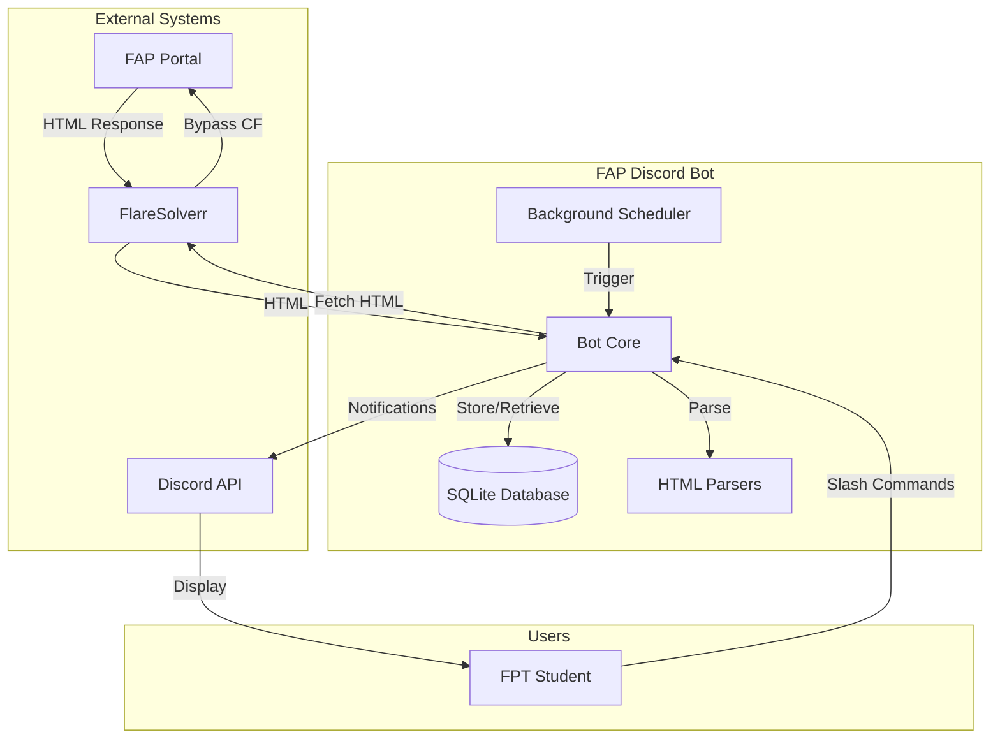
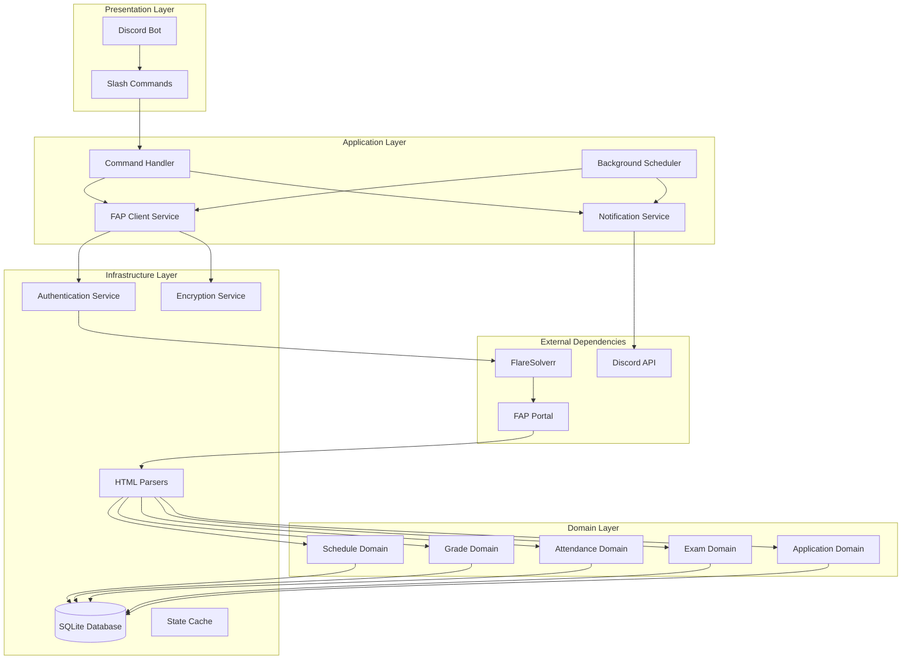
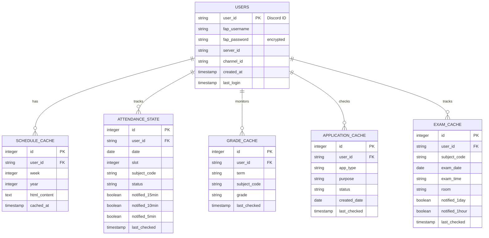
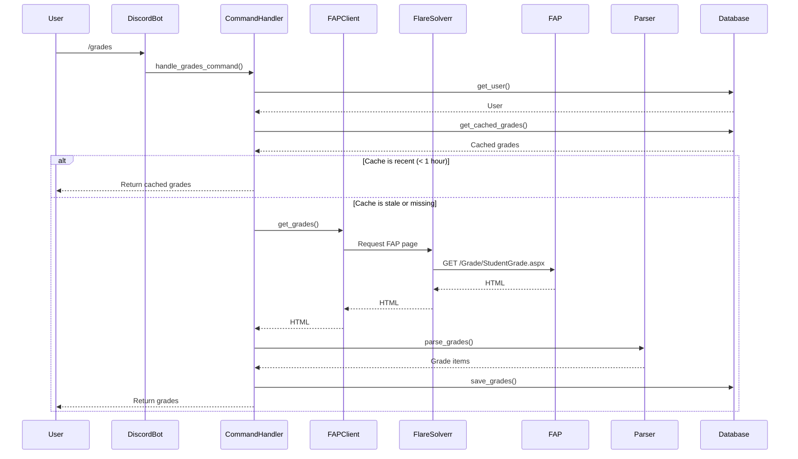
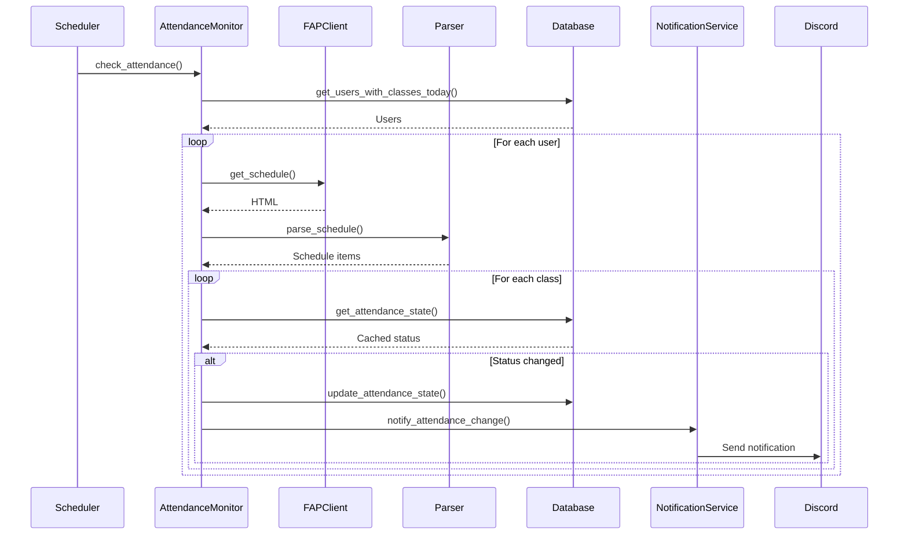
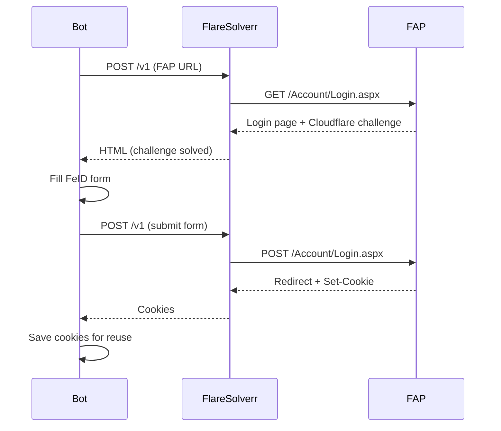

# Architecture Specification
## FAP Discord Bot - System Design Document

**Version:** 1.0
**Date:** 2026-03-07
**Architect:** Winston (BMAD AI Agent) + Admin
**Document Status:** Draft

---

## Table of Contents

1. [Document Information](#document-information)
2. [System Overview](#system-overview)
3. [Architecture Principles](#architecture-principles)
4. [System Architecture](#system-architecture)
5. [Component Design](#component-design)
6. [Data Architecture](#data-architecture)
7. [Security Architecture](#security-architecture)
8. [Integration Architecture](#integration-architecture)
9. [Deployment Architecture](#deployment-architecture)
10. [Scalability Considerations](#scalability-considerations)
11. [Technology Stack](#technology-stack)
12. [Design Decisions](#design-decisions)
13. [Trade-offs](#trade-offs)

---

## Document Information

| Field | Value |
|-------|-------|
| **Document Name** | Architecture Specification |
| **Version** | 1.0 |
| **Status** | Draft |
| **Author** | Winston (Architect Agent) |
| **Reviewers** | Admin, Barry (Dev), Quinn (QA) |
| **Related Documents** | PRD, Tech Spec, Brainstorming Session |

---

## System Overview

### Purpose
FAP Discord Bot is a **proactive monitoring and notification system** that tracks FPT University students' academic information through the FAP portal and delivers timely updates via Discord.

### System Scope
```
┌─────────────────────────────────────────────────────────────┐
│                        SYSTEM BOUNDARY                       │
├─────────────────────────────────────────────────────────────┤
│  IN SCOPE:                                                  │
│  ✓ FAP portal monitoring (schedule, grades, attendance)     │
│  ✓ Discord bot with slash commands                          │
│  ✓ Background task scheduling                               │
│  ✓ Notification delivery                                    │
│  ✓ Data persistence (SQLite)                                │
│  ✓ Cloudflare bypass (FlareSolverr)                         │
├─────────────────────────────────────────────────────────────┤
│  OUT OF SCOPE:                                              │
│  ✗ FAP portal modification                                 │
│  ✗ Official FPT mobile app features                         │
│  ✗ Multi-university support (FPT only)                     │
│  ✗ Real-time database sync (eventual consistency)          │
│  ✗ AI features (Phase 4)                                   │
└─────────────────────────────────────────────────────────────┘
```

### System Context


---

## Architecture Principles

### AP-1: Simplicity First
> **"Simplicity is the ultimate sophistication."** - Leonardo da Vinci

- **Rule:** Prefer simple solutions over clever ones
- **Application:** SQLite over PostgreSQL, single-file deployment over microservices
- **Rationale:** Easier to maintain, debug, and deploy

### AP-2: User Value Driven
> **"Architecture exists to serve user needs, not to showcase patterns."**

- **Rule:** Every architectural decision must connect to user value
- **Application:** 5-min attendance check because students need to know quickly
- **Rationale:** Avoid over-engineering for "what if" scenarios

### AP-3: Boring Technology
> **"Boring technology is stable technology."**

- **Rule:** Use battle-tested, well-documented technologies
- **Application:** Python, SQLite, Docker over bleeding-edge alternatives
- **Rationale:** Less surprises, better community support

### AP-4: Fail Gracefully
> **"The system should never be down, even when FAP is."**

- **Rule:** Always have a fallback or cached data
- **Application:** Show cached schedule when FAP is unavailable
- **Rationale:** Better to show stale data than no data

### AP-5: Design for Evolution
> **"Build for now, architect for tomorrow."**

- **Rule:** Make it easy to change without rewriting everything
- **Application:** Modular parsers, plugin-style commands
- **Rationale:** Requirements will change; architecture should adapt

---

## System Architecture

### High-Level Architecture



### Layer Responsibilities

#### Presentation Layer
- **Discord Bot:** Main bot class, event handlers
- **Slash Commands:** User-facing command definitions
- **Responsibilities:** User input, output formatting, permission checks

#### Application Layer
- **Command Handler:** Routes commands to appropriate services
- **Background Scheduler:** Manages scheduled tasks
- **Notification Service:** Formats and sends notifications
- **FAP Client:** Wraps FAP API interactions
- **Responsibilities:** Orchestration, business logic, workflow

#### Domain Layer
- **Schedule Domain:** Schedule-related logic
- **Grade Domain:** Grade-related logic
- **Attendance Domain:** Attendance-related logic
- **Exam Domain:** Exam-related logic
- **Application Domain:** Application-related logic
- **Responsibilities:** Domain rules, validation, calculations

#### Infrastructure Layer
- **HTML Parsers:** Parse FAP HTML responses
- **Database:** Persistent storage
- **State Cache:** In-memory state management
- **Authentication Service:** FAP authentication
- **Encryption Service:** Password encryption
- **Responsibilities:** Data access, external integrations, cross-cutting concerns

---

## Component Design

### C1: Discord Bot

**Purpose:** Main bot class, Discord event handling

**Responsibilities:**
- Initialize Discord bot connection
- Handle Discord events (ready, message, error)
- Load/unload command cogs
- Manage bot lifecycle

**Interface:**
```python
class FAPBot(commands.Bot):
    def __init__(self):
        # Initialize bot with intents

    async def setup_hook(self):
        # Load cogs, initialize services

    async def on_ready(self):
        # Sync commands, test FAP connection

    async def on_command_error(self, ctx, error):
        # Handle command errors
```

**Dependencies:** `discord.py`, command cogs

---

### C2: Command Handler

**Purpose:** Route and execute user commands

**Responsibilities:**
- Validate command inputs
- Check user permissions
- Call appropriate domain services
- Format command responses

**Interface:**
```python
class CommandHandler:
    def __init__(self, fap_client, database):
        self.fap_client = fap_client
        self.database = database

    async def handle_schedule_command(self, ctx, day=None):
        # Handle /schedule command

    async def handle_grades_command(self, ctx, term=None):
        # Handle /grades command

    # ... other command handlers
```

**Dependencies:** FAP Client, Database, Domain Services

---

### C3: Background Scheduler

**Purpose:** Manage scheduled tasks and intervals

**Responsibilities:**
- Schedule periodic tasks
- Execute tasks at specified times
- Handle task errors and retries
- Manage task state

**Interface:**
```python
class BackgroundScheduler:
    def __init__(self):
        self.scheduler = AsyncIOScheduler()

    def start(self):
        # Start scheduler

    def add_attendance_monitor(self, callback):
        # Add 5-min attendance check

    def add_class_reminder(self, callback):
        # Add 1-min class reminder check

    def add_evening_schedule(self, callback):
        # Add 19:30 daily schedule

    def add_hourly_checks(self, callback):
        # Add hourly grade/application checks
```

**Dependencies:** `APScheduler`, Task Services

---

### C4: Notification Service

**Purpose:** Format and send Discord notifications

**Responsibilities:**
- Create Discord embeds
- Send notifications to channels
- Handle notification failures
- Track notification history

**Interface:**
```python
class NotificationService:
    def __init__(self, bot):
        self.bot = bot

    async def send_schedule_notification(self, user, schedule):
        # Send evening schedule

    async def send_grade_notification(self, user, grade):
        # Send grade update

    async def send_exam_reminder(self, user, exam, reminder_type):
        # Send exam reminder

    # ... other notification methods
```

**Dependencies:** Discord Bot, Embed Templates

---

### C5: FAP Client Service

**Purpose:** Wrap all FAP portal interactions

**Responsibilities:**
- Authenticate with FAP
- Fetch HTML from FAP pages
- Handle FlareSolverr integration
- Manage session/cookies
- Handle FAP errors

**Interface:**
```python
class FAPClient:
    def __init__(self, username, password):
        self.username = username
        self.password = password
        self.session = None

    async def authenticate(self):
        # Authenticate and create session

    async def get_schedule(self, week, year):
        # Fetch schedule HTML

    async def get_grades(self, term):
        # Fetch grades HTML

    async def get_applications(self):
        # Fetch applications HTML

    async def get_exams(self):
        # Fetch exams HTML

    async def close(self):
        # Cleanup session
```

**Dependencies:** Playwright, FlareSolverr, BeautifulSoup

---

### C6: HTML Parsers

**Purpose:** Parse HTML responses from FAP

**Components:**

#### Schedule Parser
```python
class ScheduleParser:
    @staticmethod
    def parse_schedule(html_content):
        # Parse schedule HTML
        # Returns: List[ScheduleItem]

    @staticmethod
    def diff_schedules(old, new):
        # Compare schedules
        # Returns: List[ScheduleChange]
```

#### Grade Parser
```python
class GradeParser:
    @staticmethod
    def parse_grades(html_content):
        # Parse grades HTML
        # Returns: List[GradeItem]

    @staticmethod
    def calculate_gpa(grades, exclusions=None):
        # Calculate GPA
        # Returns: GPA breakdown
```

#### Attendance Parser
```python
class AttendanceParser:
    @staticmethod
    def parse_attendance(html_content):
        # Parse attendance from schedule
        # Returns: Dict[date, slot] -> AttendanceStatus
```

#### Exam Parser
```python
class ExamParser:
    @staticmethod
    def parse_exams(html_content):
        # Parse exam HTML
        # Returns: List[ExamItem]
```

#### Application Parser
```python
class ApplicationParser:
    @staticmethod
    def parse_applications(html_content):
        # Parse application HTML
        # Returns: List[ApplicationItem]
```

**Dependencies:** BeautifulSoup4, lxml, Data Models

---

### C7: Database Service

**Purpose:** Manage all database operations

**Responsibilities:**
- Create database connection
- Execute queries
- Manage transactions
- Handle migrations

**Interface:**
```python
class DatabaseService:
    def __init__(self, db_path):
        self.engine = create_engine(f"sqlite:///{db_path}")

    def get_user(self, user_id):
        # Get user by ID

    def create_user(self, user_data):
        # Create new user

    def save_schedule_cache(self, user, schedule):
        # Save schedule to cache

    def get_schedule_cache(self, user, week, year):
        # Get cached schedule

    def save_attendance_state(self, user, attendance):
        # Save attendance state

    def get_attendance_state(self, user, date, slot):
        # Get attendance state

    # ... other database operations
```

**Dependencies:** SQLAlchemy, SQLite

---

## Data Architecture

### Database Schema



### Data Models

#### User
```python
@dataclass
class User:
    user_id: str              # Discord user ID
    fap_username: str         # FAP username
    fap_password: str         # Encrypted password
    server_id: str            # Discord server ID
    channel_id: str           # Notification channel ID
    created_at: datetime       # Account creation time
    last_login: datetime       # Last login time
```

#### Schedule Item
```python
@dataclass
class ScheduleItem:
    date: date
    slot: int                 # 1-8
    subject_code: str
    subject_name: str
    room: str
    start_time: str           # "7:00"
    end_time: str             # "9:15"
    attendance_status: str    # "attended", "absent", "-"
```

#### Grade Item
```python
@dataclass
class GradeItem:
    term: str
    subject_code: str
    subject_name: str
    grade: float              # None if not graded
    credits: int
    status: str               # "Completed", "In Progress"
```

#### Exam Item
```python
@dataclass
class ExamItem:
    subject_code: str
    subject_name: str
    exam_date: date
    exam_time: str            # "07h00-09h00"
    room: str
    exam_type: str            # "PRACTICAL_EXAM", "Multiple_choices"
    exam_form: str            # "PE", "FE"
```

#### Application Item
```python
@dataclass
class ApplicationItem:
    app_type: str             # "Đề nghị cấp bảng điểm", etc.
    purpose: str
    created_date: date
    status: str               # "Pending", "Approved", "Rejected"
    process_note: str         # Response from admin
```

### Data Flow

#### Read Flow (Commands)


#### Write Flow (Background Tasks)


---

## Security Architecture

### Security Principles

1. **Defense in Depth:** Multiple layers of security
2. **Least Privilege:** Minimal access required
3. **Encrypt at Rest:** All sensitive data encrypted
4. **Secure Communication:** HTTPS for all external calls
5. **No Credential Logging:** Never log passwords/tokens

### Security Components

#### S1: Password Encryption
```python
class EncryptionService:
    def __init__(self, key: bytes):
        self.cipher = Fernet(key)

    def encrypt_password(self, password: str) -> str:
        # Encrypt password using Fernet
        encrypted = self.cipher.encrypt(password.encode())
        return encrypted.decode()

    def decrypt_password(self, encrypted: str) -> str:
        # Decrypt password
        decrypted = self.cipher.decrypt(encrypted.encode())
        return decrypted.decode()
```

**Algorithm:** Fernet (symmetric encryption using AES-128-CBC)
**Key Storage:** Environment variable (`ENCRYPTION_KEY`)
**Key Rotation:** Manual (documented in ops guide)

#### S2: Environment Variable Management
```bash
# .env (NEVER commit to git)
DISCORD_TOKEN=your_discord_bot_token
FAP_USERNAME=your_fap_username
FAP_PASSWORD=your_fap_password
ENCRYPTION_KEY=your_fernet_key
```

**Best Practices:**
- Never commit `.env` to version control
- Use `.env.example` as template
- Rotate keys regularly
- Use different keys for dev/prod

#### S3: SQL Injection Prevention
```python
# BAD: String concatenation
query = f"SELECT * FROM users WHERE user_id = '{user_id}'"

# GOOD: Parameterized queries
query = "SELECT * FROM users WHERE user_id = :user_id"
result = session.execute(query, {"user_id": user_id})
```

**ORM Protection:** SQLAlchemy automatically parameterizes queries

#### S4: Input Sanitization
```python
def sanitize_user_input(input_string: str) -> str:
    # Remove potentially dangerous characters
    return input_string.strip()[:1000]  # Limit length
```

---

## Integration Architecture

### I1: FAP Portal Integration

**Protocol:** HTTPS via Playwright browser automation

**Authentication Flow:**


**Session Management:**
- Cookies saved to `data/fap_cookies.json`
- Cookie expiry: 7 days
- Auto-refresh on 401 errors

**Rate Limiting:**
- Max 1 request/second
- Exponential backoff on errors
- Request queue for concurrent operations

### I2: Discord API Integration

**Gateway:** Discord.py library

**Command Registration:**
```python
async def setup_hook(self):
    # Sync slash commands
    synced = await self.tree.sync()
    logger.info(f"Synced {len(synced)} commands")
```

**Notification Delivery:**
```python
async def send_notification(self, channel_id, embed):
    channel = self.get_channel(channel_id)
    if channel:
        await channel.send(embed=embed)
```

**Error Handling:**
- Rate limit: Automatic retry with `Retry-After` header
- Permissions: Check before sending
- Network errors: Retry 3 times with exponential backoff

### I3: FlareSolverr Integration

**Deployment:** Docker container

**Configuration:**
```yaml
# docker-compose.yml
flaresolverr:
  image: flaresolverr/flaresolverr:latest
  ports:
    - "8191:8191"
  environment:
    - LOG_LEVEL=info
    - HEADLESS=true
```

**API Usage:**
```python
async def fetch_via_flaresolverr(url):
    payload = {
        "url": url,
        "cmd": "request.get",
        "maxTimeout": 60000
    }
    async with aiohttp.ClientSession() as session:
        async with session.post(
            "http://localhost:8191/v1",
            json=payload
        ) as response:
            return await response.json()
```

---

## Deployment Architecture

### D1: Container Strategy

```mermaid
graph TB
    subgraph "DigitalOcean Droplet"
        Docker[Docker Engine]

        subgraph "Bot Container"
            BotApp[FAP Bot App]
            BotData[Data Volume]
        end

        subgraph "FlareSolverr Container"
            Flare[FlareSolverr]
        end

        subgraph "Network"
            Network[Bridge Network]
        end
    end

    Docker --> BotApp
    Docker --> Flare
    BotApp --> BotData
    BotApp -.->|HTTP| Flare
    BotApp -.->|Network| Flare
```

**Container Images:**
- Bot: `fap-discord-bot:latest` (built from source)
- FlareSolverr: `flaresolverr/flaresolverr:latest` (official)

**Volumes:**
- `./data:/app/data` - Persistent data directory
- Contains: `fap.db`, `fap_cookies.json`, logs

### D2: DigitalOcean Configuration

**Droplet Spec:**
- **Region:** Singapore (sgp1) - closest to Vietnam
- **Size:** Basic $6/month (1 vCPU, 1GB RAM, 25GB SSD)
- **OS:** Ubuntu 22.04 LTS
- **SSH Key:** Uploaded public key

**Docker Compose:**
```yaml
version: '3.8'

services:
  bot:
    build: .
    container_name: fap-discord-bot
    restart: unless-stopped
    environment:
      - DISCORD_TOKEN=${DISCORD_TOKEN}
      - FAP_USERNAME=${FAP_USERNAME}
      - FAP_PASSWORD=${FAP_PASSWORD}
      - ENCRYPTION_KEY=${ENCRYPTION_KEY}
    volumes:
      - ./data:/app/data
    depends_on:
      - flaresolverr
    networks:
      - bot-network

  flaresolverr:
    image: flaresolverr/flaresolverr:latest
    container_name: flaresolverr
    restart: unless-stopped
    ports:
      - "8191:8191"
    networks:
      - bot-network

networks:
  bot-network:
    driver: bridge
```

---

## Scalability Considerations

### Current Scale (MVP)

| Metric | Target | Architecture |
|--------|--------|--------------|
| Users | 1-10 | Single SQLite DB |
| Notifications/hr | < 100 | Single scheduler |
| DB Size | < 100MB | SQLite file |
| Memory | < 512MB | Single container |

### Future Scale (Post-MVP)

| Metric | Target | Required Changes |
|--------|--------|------------------|
| Users | 10-100 | Postgres + Connection pooling |
| Notifications/hr | 100-1000 | Task queue (Celery/Redis) |
| DB Size | 100MB-1GB | Postgres + partitioning |
| Memory | 512MB-2GB | Horizontal scaling |

### Scaling Path

```
Phase 1 (MVP):
  ┌─────────────────────────────────┐
  │  Single Container                │
  │  ┌─────────────────────────────┐│
  │  │ Bot + SQLite + Scheduler    ││
  │  └─────────────────────────────┘│
  └─────────────────────────────────┘
          ↓
Phase 2 (10-100 users):
  ┌─────────────────────────────────┐
  │  Bot Container + FlareSolverr    │
  │  ┌─────────────────────────────┐│
  │  │ Bot + Postgres              ││
  │  │ + Redis Cache               ││
  │  └─────────────────────────────┘│
  └─────────────────────────────────┘
          ↓
Phase 3 (100+ users):
  ┌─────────────────────────────────┐
  │  Load Balancer                  │
  │  ┌─────────┬─────────┬─────────┐│
  │  │Bot 1    │Bot 2    │Bot N    ││
  │  └─────────┴─────────┴─────────┘│
  │  ┌─────────────────────────────┐│
  │  │ Postgres + Redis Cluster    ││
  │  │ + Celery Task Queue         ││
  │  └─────────────────────────────┘│
  └─────────────────────────────────┘
```

---

## Technology Stack

### Backend Framework
| Component | Technology | Version |
|-----------|-----------|---------|
| Language | Python | 3.11+ |
| Bot Framework | discord.py | 2.3.2+ |
| Browser Automation | patchright | 1.40.0+ |
| HTML Parsing | beautifulsoup4 | 4.12.2+ |
| HTML Parser | lxml | 4.9.3+ |

### Background Tasks
| Component | Technology | Version |
|-----------|-----------|---------|
| Scheduler | apscheduler | 3.10.0+ |
| Async Runtime | asyncio | Built-in |

### Data Layer
| Component | Technology | Version |
|-----------|-----------|---------|
| Database | SQLite | Built-in |
| ORM | SQLAlchemy | 2.0.0+ |
| Encryption | cryptography | 41.0.0+ |

### DevOps
| Component | Technology | Version |
|-----------|-----------|---------|
| Container | Docker | Latest |
| Container Orchestration | docker-compose | Latest |
| Cloud Provider | DigitalOcean | - |
| Deployment | Bash scripts | - |

---

## Design Decisions

### DD-1: SQLite vs PostgreSQL

**Decision:** SQLite for MVP

**Rationale:**
| Factor | SQLite | PostgreSQL |
|--------|--------|------------|
| Setup | Zero config | Requires server |
| Backup | File copy | pg_dump |
| Performance | Sufficient for <100 users | Required for 100+ users |
| Scalability | Requires migration | Scales horizontally |
| Complexity | Low | Medium |

**Migration Path:** SQLAlchemy ORM makes migration to Postgres straightforward

---

### DD-2: Async vs Sync

**Decision:** Async (asyncio)

**Rationale:**
| Factor | Async | Sync |
|--------|-------|------|
| Concurrency | Native | Requires threads |
| I/O Wait | Non-blocking | Blocking |
| Discord API | Native support | Requires wrapper |
| Complexity | Medium | Low |

**Trade-off:** Async code is slightly more complex but handles I/O-bound tasks efficiently

---

### DD-3: Monolith vs Microservices

**Decision:** Monolith (for MVP)

**Rationale:**
| Factor | Monolith | Microservices |
|--------|----------|---------------|
| Deployment | Single container | Multiple containers |
| Debugging | Easier | Harder |
| Development | Faster | Slower |
| Scaling | Vertical only | Horizontal |

**Migration Path:** Extract services when individual components need scaling

---

### DD-4: Fernet vs AES-GCM

**Decision:** Fernet for password encryption

**Rationale:**
| Factor | Fernet | AES-GCM |
|--------|--------|---------|
| Complexity | Low | Medium |
| Key Management | Single key | Key derivation |
| Integrity | Built-in | Separate HMAC |
| Speed | Sufficient | Faster |

**Trade-off:** Fernet is slightly slower but provides everything needed

---

## Trade-offs

### TO-1: Polling vs Webhooks

| Aspect | Polling (Chosen) | Webhooks |
|--------|------------------|----------|
| Server Load | Higher | Lower |
| Timeliness | 5-min delay | Instant |
| Complexity | Simple | Complex |
| FAP Support | Works | Not available |

**Trade-off:** Accept higher server load for simplicity

---

### TO-2: Single Channel vs Multi-Channel

| Aspect | Single Channel (Chosen) | Multi-Channel |
|--------|-------------------------|---------------|
| Setup | Simple | Complex |
| Privacy | Public (if server) | DM possible |
| Flexibility | Limited | High |

**Trade-off:** Simpler setup for MVP, DM support in Phase 2

---

### TO-3: Cache Expiry

| Data Type | Expiry Policy | Rationale |
|------------|---------------|-----------|
| Schedule | 7 days | Changes infrequently |
| Grades | Current term | Historical doesn't change |
| Attendance | Current term | History doesn't change |
| Applications | 30 days | Archive reference |
| Exams | Until passed | No longer relevant |

**Trade-off:** Balance between storage and data freshness

---

## Appendix

### A. System Constraints

| Constraint | Limit | Impact |
|------------|-------|--------|
| Discord Rate Limit | 50 messages/second | Queue notifications |
| FAP Rate Limit | Unknown (observed: ~1 req/sec) | Throttle requests |
| SQLite Concurrent Writes | 1 writer | Queue write operations |
| FlareSolverr Concurrent Sessions | ~10 | Limit concurrent FAP requests |

### B. Non-Functional Requirements Summary

| Requirement | Target | Measurement |
|-------------|--------|-------------|
| Availability | > 99% | Uptime monitoring |
| Performance | < 5 min latency | Notification timestamp |
| Scalability | 10-100 users | User count |
| Security | Encrypted credentials | Security audit |
| Maintainability | < 1 day bug fix | Lead time metric |

### C. Architecture Decision Records

| ID | Decision | Date | Status |
|----|----------|------|--------|
| ADR-001 | Use SQLite for MVP | 2026-03-07 | Accepted |
| ADR-002 | Use asyncio for concurrency | 2026-03-07 | Accepted |
| ADR-002 | Deploy as single container | 2026-03-07 | Accepted |

### D. Related Documents
- PRD: Product Requirements
- Tech Spec: Implementation Guide
- Brainstorming Session: Discussion notes

---

**Document Status:** ✅ Ready for Review
**Next Steps:** Technical Specification → Implementation → Testing
