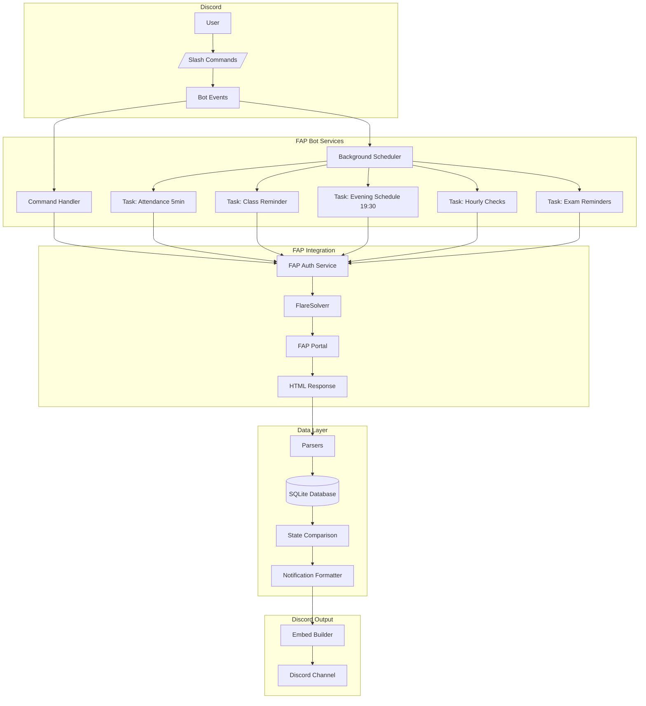
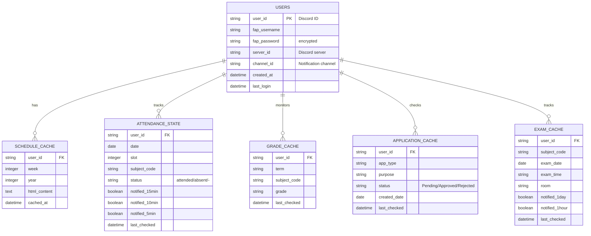

# FAP Discord Bot - Brainstorming Session Documentation

**Date:** 2026-03-07
**Session:** Party Mode - Multi-Agent Discussion
**Participants:** Admin + BMAD Agent Team
**Project:** FAP Discord Bot - Personal Assistant for FPT University Students

---

## 📋 Table of Contents

1. [Executive Summary](#executive-summary)
2. [Project Overview](#project-overview)
3. [Requirements Analysis](#requirements-analysis)
4. [Feature Specifications](#feature-specifications)
5. [Technical Architecture](#technical-architecture)
6. [Database Design](#database-design)
7. [Notification System](#notification-system)
8. [Background Tasks](#background-tasks)
9. [API Integration](#api-integration)
10. [Deployment Strategy](#deployment-strategy)
11. [Implementation Roadmap](#implementation-roadmap)
12. [Open Questions](#open-questions)
13. [Agent Contributions](#agent-contributions)

---

## Executive Summary

### Project Vision
Create a Discord bot that serves as a **personal assistant** for FPT University students, proactively monitoring their FAP (FPT Academic Portal) account and providing timely notifications about:
- Attendance status
- Schedule changes
- Grade updates
- Exam schedules
- Application status

### Key Differentiator
Unlike the myFAP app which is **push-based** (user must check), this bot is **proactive** (nudges the user with important updates).

### Target Platform
- Discord Bot (slash commands + background tasks)
- Hosted on DigitalOcean VPS (GitHub Education free tier)
- Single-user initially, with multi-user architecture for future scaling

---

## Project Overview

### Current State
- ✅ Authentication Module (FeID + FlareSolverr)
- ✅ HTML Parser for schedule
- ✅ Cookie Persistence
- ✅ Basic Discord Bot Commands (`/schedule`, `/status`)
- ✅ Week Selection

### Existing Features
| Feature | Status | Notes |
|---------|--------|-------|
| Login via FeID | ✅ Complete | Using Playwright + FlareSolverr |
| Schedule fetching | ✅ Complete | By week, term, year |
| Discord commands | ✅ Complete | `/schedule today`, `/schedule week`, `/status` |
| Cloudflare bypass | ✅ Complete | Via FlareSolverr Docker container |

---

## Requirements Analysis

### User Stories

#### Story 1: Attendance Monitoring
> "As a student, I want to be notified immediately when attendance is recorded so I can verify it's correct. If marked absent, I need to know right away to contact the teacher."

**Acceptance Criteria:**
- Check attendance status every 5 minutes
- Notify when status changes from `-` (not marked) to `attended` or `absent`
- Send escalating warnings at 15, 10, 5 minutes before class ends
- If marked `absent`, urge student to contact teacher immediately

#### Story 2: Class Reminders
> "As a student, I want to be reminded 5 minutes before class starts so I can prepare and ask the teacher to mark attendance if needed."

**Acceptance Criteria:**
- Send reminder 5 minutes before each class
- Include subject name, room number, time slot
- Remind to tell teacher to mark attendance

#### Story 3: Evening Schedule Summary
> "As a student, I want to receive tomorrow's schedule every evening at 7:30 PM so I can plan ahead."

**Acceptance Criteria:**
- Send at 7:30 PM daily
- Show all classes for tomorrow
- Highlight any changes from previous week's schedule
- Show "No classes tomorrow" if applicable

#### Story 4: Grade Updates
> "As a student, I want to be notified when new grades are posted so I don't have to keep checking FAP."

**Acceptance Criteria:**
- Check every hour for grade updates
- Notify when new grade appears
- Notify when grade changes
- If no grade yet, check exam schedule and notify when exam is coming

#### Story 5: Exam Reminders
> "As a student, I want to be reminded before exams so I don't miss them."

**Acceptance Criteria:**
- Remind 1 day before exam
- Remind 1 hour before exam
- Notify when new exam appears in schedule
- Notify when exam schedule changes

#### Story 6: Application Status
> "As a student, I want to know when my submitted applications (requests) are approved or rejected."

**Acceptance Criteria:**
- Check hourly if there are pending applications
- Check daily if no pending applications
- Notify immediately when status changes
- Notify when new application is submitted

#### Story 7: GPA Calculator
> "As a student, I want to calculate my GPA including term-by-term breakdown, excluding certain subjects (PE, music, etc.)."

**Acceptance Criteria:**
- Calculate cumulative GPA
- Show term-by-term breakdown
- Allow excluding specific subjects
- Support configurable exclusion list

---

## Feature Specifications

### Phase 1: MVP Foundation (17 points)

#### 1.1 Evening Schedule Notification
**Trigger:** Daily at 7:30 PM (19:30)

**Output Format:** Discord Embed
```
📅 Lịch học ngày mai - [Tomorrow's Date]

┌─────────────────────────────────────┐
│ 🕐 Slot 1-2 (7:00-9:15)             │
│ **Database Systems (DBI202)**       │
│ 📍 Room 115                         │
└─────────────────────────────────────┘

┌─────────────────────────────────────┐
│ 🕐 Slot 3-4 (9:30-11:45)            │
│ **Statistics (MAS291)**             │
│ 📍 Room 012                         │
└─────────────────────────────────────┘

💡 Thay đổi so với tuần trước: Không có
```

**Edge Cases:**
- No classes tomorrow → Show "明天 được nghỉ"
- FAP down → Show cached data with error footer

#### 1.2 Schedule Change Detection
**Trigger:** After evening schedule fetch

**Logic:**
```python
old_schedule = load_from_cache('next_week')
new_schedule = fetch_from_fap('next_week')

changes = diff_schedules(old_schedule, new_schedule)

if changes:
    notify_schedule_changes(changes)
save_to_cache('next_week', new_schedule)
```

**Change Types Detected:**
- New class added
- Class removed
- Room changed
- Time changed
- Teacher changed (if available)

#### 1.3 Grade Check Command
**Command:** `/grades [term?]`

**Output Format:** Discord Embed
```
📊 Bảng điểm - Fall 2025

┌─────────────────────────────────────┐
│ DBI202 - Database Systems           │
│ 📈 Điểm: 8.5                        │
│ 📝 Hệ số: 3                         │
│ 🎯 Ảnh hưởng: +0.255 GPA            │
└─────────────────────────────────────┘

┌─────────────────────────────────────┐
│ MAS291 - Statistics                 │
│ 📈 Điểm: 9.0                        │
│ 📝 Hệ số: 3                         │
│ 🎯 Ảnh hưởng: +0.270 GPA            │
└─────────────────────────────────────┘

🎯 GPA kỳ này: 3.85
🎯 GPA tích lũy: 3.72
```

**Default Term:** Latest term with grades

#### 1.4 Attendance Check Command
**Command:** `/attendance [term?] [week?]`

**Output Format:** Discord Embed
```
📋 Điểm danh - Fall 2025 - Tuần 5

┌─────────────────────────────────────┐
│ 02/03/2026 - Slot 1-2               │
│ DBI202 - Database Systems           │
│ ✅ Có mặt                           │
└─────────────────────────────────────┘

┌─────────────────────────────────────┐
│ 02/03/2026 - Slot 3-4               │
│ MAS291 - Statistics                 │
│ ✅ Có mặt                           │
└─────────────────────────────────────┘

📊 Thống kê: 12/12 buổi có mặt
```

**Default:** Current term, current week

#### 1.5 Exam Schedule Command
**Command:** `/exams [term?]`

**Output Format:** Discord Embed
```
📝 Lịch thi - Fall 2025

┌─────────────────────────────────────┐
│ DBI202 - Database Systems           │
│ 📅 22/03/2026                       │
│ 🕐 07:00-09:00                      │
│ 📍 Room 115                         │
│ 📋 Thi thực hành                   │
└─────────────────────────────────────┘

┌─────────────────────────────────────┐
│ DBI202 - Database Systems           │
│ 📅 02/04/2026                       │
│ 🕐 12:50-14:20                      │
│ 📍 Room 131                         │
│ 📋 Trắc nghiệm                      │
└─────────────────────────────────────┘
```

**New Exam Detection:**
- Notify immediately when new exam appears
- Notify when exam details change

---

### Phase 2: Notifications (15 points)

#### 2.1 Class Reminder (5 min before)
**Trigger:** 5 minutes before class start time

**Output Format:** Discord Embed
```
⏰ Sắp vào lớp!

**Database Systems (DBI202)** bắt đầu sau 5 phút

📍 Room 115
🕐 7:00 - 9:15

📝 Chuẩn bị: Máy tính, sạc pin, water
💡 Đừng quên nhắc thầy cô điểm danh!
```

#### 2.2 Grade Update Notifications
**Trigger:** Hourly check detects grade change

**Output Format (New Grade):**
```
📊 Có điểm mới!

**Database Systems (DBI202)**

📈 Điểm: 8.5
📝 Hệ số: 3

🎯 Ảnh hưởng GPA: +0.255
```

**Output Format (Grade Changed):**
```
📊 Điểm đã cập nhật!

**Database Systems (DBI202)**

📉 Trước: 8.0
📈 Sau: 8.5

🎯 Thay đổi GPA: +0.015
```

#### 2.3 Exam Reminders
**Trigger 1:** 1 day before exam
**Trigger 2:** 1 hour before exam

**Output Format (1 Day Before):**
```
📝 Nhắc nhở thi cuối kỳ

**Ngày mai:** Database Systems (DBI202)

📅 22/03/2026
🕐 7:00-9:00
📍 Room 115
📋 Hình thức: Thi thực hành

📚 Chuẩn bị: CMND/Thẻ SVN, bút, giấy
🔔 Lưu ý: Đi sớm 15 phút!
```

**Output Format (1 Hour Before):**
```
🚨 Sắp thi rồi!

Còn 1 giờ nữa là thi!

**Database Systems (DBI202)**
📍 Room 115

⏰ Giờ thi: 7:00-9:00
📝 Hình thức: Thi thực hành
```

#### 2.4 GPA Calculator
**Command:** `/gpa [term?] [--exclude="Món A,Môn B"]`

**Output Format:** Discord Embed
```
🧮 GPA Calculator

📊 GPA Tích Lũy: 3.72

┌─────────────────────────────────────┐
│ Fall 2024                           │
│ GPA: 3.65                           │
│ Số tín chỉ: 18                      │
│ └── Chỉ tính các môn chính khóa    │
└─────────────────────────────────────┘

┌─────────────────────────────────────┐
│ Spring 2025                         │
│ GPA: 3.85                           │
│ Số tín chỉ: 15                      │
│ └── Đã loại trừ: Võ, Nhạc          │
└─────────────────────────────────────┘

📝 Loại trừ mặc định:
- Võ (mã môn bắt đầu bằng 'PE')
- Nhạc cụ
- Tiếng Anh (Trans 1-6)

💡 Dùng --exclude để loại trừ thêm môn
```

---

### Phase 3: Real-time Monitoring (21 points)

#### 3.1 Attendance Monitoring (Every 5 minutes)
**Trigger:** Every 5 minutes during class hours

**Logic:**
```python
async def monitor_attendance():
    now = get_current_time()
    today_schedule = get_schedule(date=now.date())

    for class_item in today_schedule:
        if is_class_time(class_item, now):
            cached_status = get_cached_attendance(class_item)
            current_status = fetch_attendance_from_fap(class_item)

            if cached_status != current_status:
                if current_status == 'attended':
                    notify_attendance_recorded(class_item)
                elif current_status == 'absent':
                    notify_absent_alert(class_item)

                update_cache(class_item, current_status)

            # Check for class ending warnings
            minutes_remaining = get_minutes_until_class_ends(class_item, now)
            if minutes_remaining in [15, 10, 5]:
                if not get_notification_sent(class_item, minutes_remaining):
                    notify_class_ending_soon(class_item, minutes_remaining)
                    mark_notification_sent(class_item, minutes_remaining)
```

**Output Format (Attendance Recorded):**
```
✅ Điểm danh thành công!

**Database Systems (DBI202)** - Slot 1-2

✅ Đã ghi nhận: Có mặt
```

**Output Format (Absent Alert):**
```
⚠️ CẢNH BÁO: Ghi nhận vắng mặt!

**Database Systems (DBI202)** - Slot 1-2

❌ Hệ thống ghi nhận: Vắng mặt

👉 Hãy liên hệ ngay với giảng viên để điểm danh bổ sung!
```

**Output Format (Class Ending Warning):**
```
⏰ Cảnh báo: Còn 15 phút hết tiết!

**Database Systems (DBI202)** - Slot 1-2

📌 Đảm bảo bạn đã được điểm danh!
Nếu chưa, hãy báo giáo viên ngay!
```

#### 3.2 Application Status Monitoring
**Trigger Logic:**
```python
async def monitor_applications():
    applications = fetch_applications_from_fap()

    # Determine check frequency
    has_pending = any(app.status == 'Pending' for app in applications)

    for app in applications:
        cached = get_cached_application(app.id)

        if cached.status != app.status:
            if app.status == 'Approved':
                notify_application_approved(app)
            elif app.status == 'Rejected':
                notify_application_rejected(app)
            elif cached.status == 'Approved' and app.status == 'Pending':
                # This shouldn't happen, but log it
                log_unexpected_status_change(app)

            update_cache(app)

    # Update check frequency
    if has_pending:
        schedule_next_check('1 hour')
    else:
        schedule_next_check('1 day')
```

**Output Format (Approved):**
```
📄 Trạng thái đơn đã thay đổi!

**In giấy khen**

Trước: `Pending`
Sau: `Approved`

📅 Ngày tạo: 27/10/2025
📝 Ghi chú: P.CTSV đã nhận được thông tin của em...
```

**Output Format (Rejected):**
```
📄 Trạng thái đơn đã thay đổi!

**Học song song**

Trước: `Pending`
Sau: `Rejected`

📅 Ngày tạo: 21/12/2024
📝 Lý do: Hiện chưa có kế hoạch triển khai...
```

**Check Frequency:**
- Has pending applications → Check every hour
- No pending applications → Check once per day

#### 3.3 Hourly Grade Check
**Trigger:** Every hour

**Logic:**
```python
async def check_grades():
    current_term = get_current_term()
    grades = fetch_grades(term=current_term)

    for subject in grades:
        cached = get_cached_grade(subject.code)

        # Case 1: New grade appeared
        if not cached.grade and subject.grade:
            notify_new_grade(subject)

        # Case 2: Grade changed
        elif cached.grade != subject.grade:
            notify_grade_changed(subject, cached.grade)

        # Case 3: No grade yet, check exam
        elif not subject.grade:
            exam = get_cached_exam(subject.code)
            if exam and is_upcoming(exam):
                days_until = (exam.date - now).days
                if days_until <= 3:
                    notify_exam_coming_soon(exam)
            elif exam and exam.date < now:
                notify_exam_done_awaiting_grade(subject)

        update_cache(subject)
```

---

## Technical Architecture

### System Architecture Diagram



### Component Architecture

```
fap-discord-bot/
├── bot/
│   ├── bot.py                    # Main bot class
│   ├── commands/
│   │   ├── schedule.py           # Schedule commands
│   │   ├── status.py             # Bot status command
│   │   ├── grades.py             # Grade commands (NEW)
│   │   ├── attendance.py         # Attendance commands (NEW)
│   │   ├── applications.py       # Application commands (NEW)
│   │   ├── exams.py              # Exam commands (NEW)
│   │   ├── gpa.py                # GPA calculator (NEW)
│   │   └── config.py             # User configuration (NEW)
│   ├── services/
│   │   ├── scheduler.py          # Background task manager (NEW)
│   │   ├── notifier.py           # Discord notification formatter (NEW)
│   │   └── fap_client.py         # FAP API wrapper (NEW)
│   ├── parsers/
│   │   ├── schedule_parser.py    # Schedule HTML parser
│   │   ├── grade_parser.py       # Grade HTML parser (NEW)
│   │   ├── attendance_parser.py  # Attendance status parser (NEW)
│   │   ├── application_parser.py # Application HTML parser (NEW)
│   │   └── exam_parser.py        # Exam HTML parser (NEW)
│   ├── database/
│   │   ├── models.py             # SQLAlchemy models (NEW)
│   │   └── db.py                 # Database connection (NEW)
│   └── utils/
│       ├── time_helper.py        # Timezone utilities (NEW)
│       └── diff_helper.py        # Schedule comparison (NEW)
├── data/
│   └── fap.db                    # SQLite database (NEW)
├── docs/
│   ├── SETUP.md                  # Setup guide (NEW)
│   ├── COMMANDS.md               # Command reference (NEW)
│   ├── CONFIG.md                 # Configuration guide (NEW)
│   ├── TROUBLESHOOTING.md        # Troubleshooting (NEW)
│   ├── DEPLOYMENT.md             # DigitalOcean deployment (NEW)
│   └── architecture.mmd          # Mermaid diagrams (NEW)
└── deployment/
    ├── Dockerfile                # Docker container (NEW)
    ├── docker-compose.yml        # Docker compose (NEW)
    └── digitalocean/
        ├── deploy.sh             # Deployment script (NEW)
        └── setup.sh              # Setup script (NEW)
```

---

## Database Design

### Entity-Relationship Diagram



### Table Schemas

#### users
```sql
CREATE TABLE users (
    user_id TEXT PRIMARY KEY,
    fap_username TEXT NOT NULL,
    fap_password TEXT NOT NULL,  -- Encrypted with Fernet
    server_id TEXT NOT NULL,
    channel_id TEXT NOT NULL,
    created_at TIMESTAMP DEFAULT CURRENT_TIMESTAMP,
    last_login TIMESTAMP
);
```

#### schedule_cache
```sql
CREATE TABLE schedule_cache (
    id INTEGER PRIMARY KEY AUTOINCREMENT,
    user_id TEXT NOT NULL,
    week INTEGER NOT NULL,
    year INTEGER NOT NULL,
    html_content TEXT,
    cached_at TIMESTAMP DEFAULT CURRENT_TIMESTAMP,
    FOREIGN KEY (user_id) REFERENCES users(user_id),
    UNIQUE(user_id, week, year)
);
```

#### attendance_state
```sql
CREATE TABLE attendance_state (
    id INTEGER PRIMARY KEY AUTOINCREMENT,
    user_id TEXT NOT NULL,
    date DATE NOT NULL,
    slot INTEGER NOT NULL,
    subject_code TEXT NOT NULL,
    status TEXT NOT NULL,  -- 'attended', 'absent', '-'
    notified_15min BOOLEAN DEFAULT 0,
    notified_10min BOOLEAN DEFAULT 0,
    notified_5min BOOLEAN DEFAULT 0,
    last_checked TIMESTAMP DEFAULT CURRENT_TIMESTAMP,
    FOREIGN KEY (user_id) REFERENCES users(user_id),
    UNIQUE(user_id, date, slot, subject_code)
);
```

#### grade_cache
```sql
CREATE TABLE grade_cache (
    id INTEGER PRIMARY KEY AUTOINCREMENT,
    user_id TEXT NOT NULL,
    term TEXT NOT NULL,
    subject_code TEXT NOT NULL,
    grade TEXT,
    last_checked TIMESTAMP DEFAULT CURRENT_TIMESTAMP,
    FOREIGN KEY (user_id) REFERENCES users(user_id),
    UNIQUE(user_id, term, subject_code)
);
```

#### application_cache
```sql
CREATE TABLE application_cache (
    id INTEGER PRIMARY KEY AUTOINCREMENT,
    user_id TEXT NOT NULL,
    app_type TEXT NOT NULL,
    purpose TEXT NOT NULL,
    status TEXT NOT NULL,  -- 'Pending', 'Approved', 'Rejected'
    created_date DATE NOT NULL,
    last_checked TIMESTAMP DEFAULT CURRENT_TIMESTAMP,
    FOREIGN KEY (user_id) REFERENCES users(user_id)
);
```

#### exam_cache
```sql
CREATE TABLE exam_cache (
    id INTEGER PRIMARY KEY AUTOINCREMENT,
    user_id TEXT NOT NULL,
    subject_code TEXT NOT NULL,
    exam_date DATE NOT NULL,
    exam_time TEXT NOT NULL,
    room TEXT NOT NULL,
    notified_1day BOOLEAN DEFAULT 0,
    notified_1hour BOOLEAN DEFAULT 0,
    last_checked TIMESTAMP DEFAULT CURRENT_TIMESTAMP,
    FOREIGN KEY (user_id) REFERENCES users(user_id),
    UNIQUE(user_id, subject_code)
);
```

---

## Notification System

### Notification Types & Triggers

| Notification | Trigger | Frequency | Priority |
|--------------|---------|-----------|----------|
| Evening Schedule | Daily 19:30 | Once/day | Medium |
| Class Reminder | 5 min before class | Per class | High |
| Attendance Recorded | Status change | Immediate | High |
| Absent Alert | Status change to absent | Immediate | Critical |
| Class Ending Warning | 15/10/5 min before end | Per class | High |
| New Grade | Grade appears | Hourly check | Medium |
| Grade Changed | Grade value changes | Hourly check | Medium |
| Exam 1 Day | 24 hours before exam | Once | High |
| Exam 1 Hour | 1 hour before exam | Once | Critical |
| New Exam | New exam detected | Hourly check | High |
| Exam Changed | Exam details change | Hourly check | High |
| Application Approved | Status change | Hourly/Daily* | Medium |
| Application Rejected | Status change | Hourly/Daily* | Medium |

*Hourly if pending applications exist, daily if none

### Notification Templates

#### Template 1: Evening Schedule
```python
{
    "title": "📅 Lịch học ngày mai - {tomorrow_date}",
    "color": 0x00ff00,
    "fields": [
        {
            "name": "🕐 Slot 1-2 (7:00-9:15)",
            "value": "**{subject_name} ({subject_code})**\n📍 Room {room_number}"
        },
        # ... more slots
    ],
    "footer": "💡 Thay đổi so với tuần trước: {change_summary}",
    "timestamp": "{current_time}"
}
```

#### Template 2: Class Reminder
```python
{
    "title": "⏰ Sắp vào lớp!",
    "color": 0xffff00,
    "description": "**{subject_name} ({subject_code})** bắt đầu sau 5 phút\n\n📍 **Room {room_number}**\n🕐 **{start_time} - {end_time}**",
    "fields": [
        {"name": "📝 Chuẩn bị", "value": "Máy tính, sạc pin, water"},
        {"name": "💡 Nhắc nhở", "value": "Đừng quên nhắc thầy cô điểm danh!"}
    ]
}
```

#### Template 3: Attendance Recorded
```python
{
    "title": "✅ Điểm danh thành công!",
    "color": 0x00ff00,
    "description": "**{subject_name} ({subject_code})** - Slot {slot}\n\n✅ Đã ghi nhận: Có mặt"
}
```

#### Template 4: Absent Alert
```python
{
    "title": "⚠️ CẢNH BÁO: Ghi nhận vắng mặt!",
    "color": 0xff0000,
    "description": "**{subject_name} ({subject_code})** - Slot {slot}\n\n❌ Hệ thống ghi nhận: Vắng mặt\n\n👉 **Hãy liên hệ ngay với giảng viên để điểm danh bổ sung!**",
    "fields": [
        {"name": "🕐 Thời gian", "value": "{date} {time}"},
        {"name": "📍 Phòng", "value": "{room}"}
    ]
}
```

#### Template 5: Class Ending Warning
```python
{
    "title": f"⏰ Cảnh báo: Còn {minutes} phút hết tiết!",
    "color": 0xff6600,
    "description": f"**{subject_name} ({subject_code})** - Slot {slot}\n\n📌 Đảm bảo bạn đã được điểm danh!\nNếu chưa, hãy báo giáo viên ngay!",
    "fields": [
        {"name": "⏰ Thời gian còn lại", "value": f"{minutes} phút"},
        {"name": "📍 Phòng", "value": "{room}"}
    ]
}
```

#### Template 6: New Grade
```python
{
    "title": "📊 Có điểm mới!",
    "color": 0x00bfff,
    "description": "**{subject_name} ({subject_code})**\n\n📈 Điểm: **{grade}**\n📝 Hệ số: **{credits}**",
    "fields": [
        {"name": "🎯 Ảnh hưởng GPA", "value": f"{gpa_impact:+} điểm"}
    ]
}
```

#### Template 7: Grade Changed
```python
{
    "title": "📊 Điểm đã cập nhật!",
    "color": 0xffaa00,
    "description": "**{subject_name} ({subject_code})**\n\n📉 Trước: **{old_grade}**\n📈 Sau: **{new_grade}**",
    "fields": [
        {"name": "🎯 Thay đổi GPA", "value": f"{gpa_change:+} điểm"}
    ]
}
```

#### Template 8: Exam 1 Day
```python
{
    "title": "📝 Nhắc nhở thi cuối kỳ",
    "color": 0x9b59b6,
    "description": "**Ngày mai:** {subject_name} ({subject_code})\n\n📅 **{exam_date}**\n🕐 **{exam_time}**\n📍 **Room {room}**\n📋 **Hình thức:** {exam_type}",
    "fields": [
        {"name": "📚 Chuẩn bị", "value": "CMND/Thẻ SVN, bút, giấy"},
        {"name": "🔔 Lưu ý", "value": "Đi sớm 15 phút!"}
    ]
}
```

#### Template 9: Exam 1 Hour
```python
{
    "title": "🚨 Sắp thi rồi!",
    "color": 0xff0000,
    "description": "Còn **1 giờ** nữa là thi!\n\n**{subject_name} ({subject_code})**\n📍 **Room {room}**",
    "fields": [
        {"name": "⏰ Giờ thi", "value": "{exam_time}"},
        {"name": "📝 Hình thức", "value": "{exam_type}"}
    ]
}
```

#### Template 10: New Exam
```python
{
    "title": "📝 PHÁT HIỆN LỊCH THI MỚI!",
    "color": 0x9b59b6,
    "description": "**{subject_name} ({subject_code})**\n\n📅 {exam_date}\n🕐 {exam_time}\n📍 {room}\n📋 {exam_type}",
    "footer": "⏰ Bot sẽ nhắc trước 1 ngày và 1 tiếng"
}
```

#### Template 11: Exam Changed
```python
{
    "title": "⚠️ LỊCH THI CÓ THAY ĐỔI!",
    "color": 0xff6600,
    "description": "**{subject_name} ({subject_code})**\n\n📅 Trước: {old_date} {old_time}\n📅 Sau: {new_date} {new_time}\n📍 Phòng: {old_room} → {new_room}",
    "footer": "🔄 Vui lòng cập nhật lại lịch cá nhân"
}
```

#### Template 12: Application Approved
```python
{
    "title": "📄 Trạng thái đơn đã thay đổi!",
    "color": 0x00ff00,
    "description": f"**{app_type}**\n\nTrước: `Pending`\nSau: `Approved`",
    "fields": [
        {"name": "📅 Ngày tạo", "value": "{created_date}"},
        {"name": "📝 Nội dung", "value": "{purpose}"}
    ]
}
```

#### Template 13: Application Rejected
```python
{
    "title": "📄 Trạng thái đơn đã thay đổi!",
    "color": 0xff0000,
    "description": f"**{app_type}**\n\nTrước: `Pending`\nSau: `Rejected`",
    "fields": [
        {"name": "📅 Ngày tạo", "value": "{created_date}"},
        {"name": "📝 Lý do", "value": "{rejection_reason}"},
        {"name": "💡 Ghi chú", "value": "{process_note}"}
    ]
}
```

#### Template 14: FAP Down (with Cache)
```python
{
    "title": "⚠️ FAP không khả dụng",
    "color": 0xff0000,
    "description": "Không thể kết nối đến FAP Portal. Hiển thị dữ liệu đã lưu:",
    "fields": cached_data_fields,
    "footer": f"🕐 Dữ liệu cập nhật lần cuối: {last_update} ({relative_time})"
}
```

---

## Background Tasks

### Task Schedule Overview

```
┌─────────────────────────────────────────────────────────────┐
│                    BACKGROUND TASKS                          │
├─────────────────────────────────────────────────────────────┤
│  Task                    │ Frequency  │ Time/Trigger        │
├─────────────────────────────────────────────────────────────┤
│  Attendance Monitor       │ Every 5min │ During class hours │
│  Class Reminder           │ Every 1min │ 5min before class  │
│  Evening Schedule         │ Daily      │ 19:30              │
│  Grade Check              │ Hourly     │ :00                │
│  Application Check        │ Variable   │ Hourly* or Daily** │
│  Exam Reminder            │ Hourly     │ Check for triggers  │
│  Schedule Change Check    │ Daily      │ 19:30 (with even.) │
└─────────────────────────────────────────────────────────────┘
```

*Hourly if pending applications exist
**Daily if no pending applications

### Task 1: Attendance Monitor (Every 5 minutes)

```python
from apscheduler.schedulers.asyncio import AsyncIOScheduler

scheduler = AsyncIOScheduler()

@scheduler.scheduled_job('cron', minute='*/5')
async def attendance_monitor():
    """Check attendance status every 5 minutes"""
    users = get_all_users()

    for user in users:
        now = get_current_time()  # GMT+7
        today_schedule = get_schedule(user, date=now.date())

        for class_item in today_schedule:
            if is_class_active(class_item, now):
                await check_and_notify_attendance(user, class_item)

async def check_and_notify_attendance(user, class_item):
    """Check attendance status and notify if changed"""
    cached = get_cached_attendance(user, class_item)
    current = fetch_attendance_from_fap(user, class_item)

    if cached.status != current.status:
        if current.status == 'attended':
            await notify_attendance_recorded(user, class_item)
        elif current.status == 'absent':
            await notify_absent_alert(user, class_item)

        save_attendance_cache(user, class_item, current)

    # Check for class ending warnings
    minutes_until_end = get_minutes_until_class_ends(class_item)
    if minutes_until_end in [15, 10, 5]:
        if not was_warning_sent(user, class_item, minutes_until_end):
            await notify_class_ending_warning(user, class_item, minutes_until_end)
            mark_warning_sent(user, class_item, minutes_until_end)
```

### Task 2: Class Reminder (Every minute)

```python
@scheduler.scheduled_job('cron', minute='*')
async def class_reminder_checker():
    """Check every minute for classes starting in 5 minutes"""
    users = get_all_users()

    for user in users:
        now = get_current_time()
        upcoming_classes = get_classes_starting_soon(user, minutes=5, current_time=now)

        for class_item in upcoming_classes:
            if not was_reminder_sent(user, class_item):
                await send_class_reminder(user, class_item)
                mark_reminder_sent(user, class_item)
```

### Task 3: Evening Schedule (Daily 19:30)

```python
@scheduler.scheduled_job('cron', hour=19, minute=30)
async def evening_schedule():
    """Send tomorrow's schedule at 7:30 PM"""
    users = get_all_users()
    tomorrow = (get_current_date() + timedelta(days=1))

    for user in users:
        try:
            schedule = fetch_schedule(user, date=tomorrow)
            old_schedule = get_cached_schedule(user, week=get_week_number(tomorrow))

            if schedule:
                changes = diff_schedules(old_schedule, schedule) if old_schedule else None
                await send_evening_schedule(user, schedule, changes)
                save_schedule_cache(user, schedule)
            else:
                await send_no_classes_notification(user, tomorrow)

        except FAPDownException:
            cached = get_cached_schedule(user, date=tomorrow)
            await send_fap_down_with_cache(user, cached)
```

### Task 4: Grade Check (Hourly)

```python
@scheduler.scheduled_job('cron', minute='0')
async def grade_checker():
    """Check for grade updates every hour"""
    users = get_all_users()
    current_term = get_current_term()

    for user in users:
        grades = fetch_grades(user, term=current_term)

        for subject in grades:
            cached = get_cached_grade(user, subject.code)

            if not cached.grade and subject.grade:
                await notify_new_grade(user, subject)
            elif cached.grade != subject.grade:
                await notify_grade_changed(user, subject, cached.grade)
            elif not subject.grade:
                # No grade yet, check if exam is coming
                exam = get_cached_exam(user, subject.code)
                if exam:
                    days_until = (exam.date - get_current_date()).days
                    if days_until == 1:
                        await notify_exam_1day(user, exam)
                    elif days_until <= 3:
                        await notify_exam_coming_soon(user, exam, days_until)
                    elif exam.date < get_current_date():
                        await notify_exam_done_awaiting_grade(user, subject)

            save_grade_cache(user, subject)
```

### Task 5: Application Check (Variable Frequency)

```python
@scheduler.scheduled_job('cron', minute='0')  # Runs every hour
async def application_checker():
    """Check application status"""
    users = get_all_users()

    for user in users:
        applications = fetch_applications(user)
        has_pending = any(app.status == 'Pending' for app in applications)

        for app in applications:
            cached = get_cached_application(user, app.id)

            if cached.status != app.status:
                if app.status == 'Approved':
                    await notify_application_approved(user, app)
                elif app.status == 'Rejected':
                    await notify_application_rejected(user, app)

                save_application_cache(user, app)

        # Update check frequency based on pending status
        if has_pending:
            # Already checking hourly, no change needed
            pass
        else:
            # Schedule next check for 24 hours later
            schedule_next_application_check(user, hours=24)
```

### Task 6: Exam Reminders (Hourly)

```python
@scheduler.scheduled_job('cron', minute='0')
async def exam_reminder_checker():
    """Check for upcoming exams and send reminders"""
    users = get_all_users()

    for user in users:
        exams = fetch_exams(user)
        now = get_current_datetime()

        for exam in exams:
            hours_until = (exam.datetime - now).total_seconds() / 3600

            # 1 day reminder (24 hours)
            if 23 <= hours_until <= 25:
                if not exam.notified_1day:
                    await notify_exam_1day(user, exam)
                    mark_exam_notified(user, exam, '1day')

            # 1 hour reminder
            elif 0.5 <= hours_until <= 1.5:
                if not exam.notified_1hour:
                    await notify_exam_1hour(user, exam)
                    mark_exam_notified(user, exam, '1hour')
```

---

## API Integration

### FAP Portal Pages

| Page | URL | Data Extracted | Parser |
|------|-----|----------------|--------|
| Schedule | `/Report/ScheduleOfWeek.aspx` | Classes, times, rooms, attendance | `schedule_parser.py` |
| Grades | `/Grade/StudentGrade.aspx` | Grades by term, courses | `grade_parser.py` |
| Applications | `/App/AcadAppView.aspx` | Applications, status, dates | `application_parser.py` |
| Exams | `/Exam/ScheduleExams.aspx` | Exam dates, times, rooms | `exam_parser.py` |

### HTML Parsing Examples

#### Schedule Table Structure
```html
<table class="table table-bordered">
  <thead>
    <tr>
      <th>Year</th>
      <th>Term</th>
      <th>Week</th>
      <th>Day</th>
      <th>Date</th>
      <th>Slot</th>
      <th>Start Time</th>
      <th>End Time</th>
      <th>Subject Code</th>
      <th>Subject Name</th>
      <th>Room</th>
      <th>Status</th>
    </tr>
  </thead>
  <tbody>
    <tr>
      <td>2025</td>
      <td>Fall2025</td>
      <td>5</td>
      <td>Mon</td>
      <td>02/03/2026</td>
      <td>1</td>
      <td>7:00</td>
      <td>9:15</td>
      <td>DBI202</td>
      <td>Database Systems</td>
      <td>115</td>
      <td>attended</td>
    </tr>
  </tbody>
</table>
```

#### Grade Table Structure
```html
<table>
  <thead>
    <tr>
      <th>No</th>
      <th>Subject Code</th>
      <th>Subject Name</th>
      <th>Credit</th>
      <th>Grade</th>
      <th>Status</th>
    </tr>
  </thead>
  <tbody>
    <tr>
      <td>1</td>
      <td>DBI202</td>
      <td>Database Systems</td>
      <td>3</td>
      <td>8.5</td>
      <td>Completed</td>
    </tr>
  </tbody>
</table>
```

#### Application Table Structure
```html
<table class="table table-bordered">
  <thead>
    <tr>
      <th>Type</th>
      <th>Purpose</th>
      <th>CreateDate</th>
      <th>ProcessNote</th>
      <th>File</th>
      <th>Status</th>
    </tr>
  </thead>
  <tbody>
    <tr>
      <td>Các loại đơn khác</td>
      <td>In giấy khen</td>
      <td>27/10/2025</td>
      <td>P.CTSV đã nhận được thông tin...</td>
      <td></td>
      <td><p class="text-success"><b>Approved</b></p></td>
    </tr>
  </tbody>
</table>
```

#### Exam Table Structure
```html
<table>
  <thead>
    <tr>
      <th>No</th>
      <th>SubjectCode</th>
      <th>Subject Name</th>
      <th>Date</th>
      <th>Room No</th>
      <th>Time</th>
      <th>Exam Form</th>
      <th>Exam</th>
    </tr>
  </thead>
  <tbody>
    <tr>
      <td>1</td>
      <td>DBI202</td>
      <td>Database Systems</td>
      <td>22/03/2026</td>
      <td>115</td>
      <td>07h00-09h00</td>
      <td>PRACTICAL_EXAM</td>
      <td>PE</td>
    </tr>
  </tbody>
</table>
```

---

## Deployment Strategy

### DigitalOcean Deployment (GitHub Education)

#### Prerequisites
- GitHub Education account (for free credits)
- DigitalOcean account linked to GitHub Education
- Basic Docker knowledge
- Git CLI

#### Deployment Options

**Option 1: Basic Droplet (Recommended for MVP)**
```bash
# Create droplet via DigitalOcean CLI
doctl compute droplet create fap-bot \
  --region sgp1 \
  --image ubuntu-22-04-x64 \
  --size s-1vcpu-1gb \
  --ssh-keys <your-ssh-key-id>
```

**Option 2: Docker Deployment**
```yaml
# docker-compose.yml
version: '3.8'

services:
  fap-bot:
    build: .
    container_name: fap-discord-bot
    restart: unless-stopped
    environment:
      - DISCORD_TOKEN=${DISCORD_TOKEN}
      - FAP_USERNAME=${FAP_USERNAME}
      - FAP_PASSWORD=${FAP_PASSWORD}
    volumes:
      - ./data:/app/data
    depends_on:
      - flaresolverr

  flaresolverr:
    image: flaresolverr/flaresolverr:latest
    container_name: flaresolverr
    restart: unless-stopped
    ports:
      - "8191:8191"
```

**Option 3: App Platform (PaaS)**
```yaml
# app.yaml
name: fap-discord-bot
services:
- name: bot
  github:
    repo: your-username/fap-discord-bot
    branch: main
  envs:
  - key: DISCORD_TOKEN
    value: ${DISCORD_TOKEN}
  - key: FAP_USERNAME
    value: ${FAP_USERNAME}
  - key: FAP_PASSWORD
    value: ${FAP_PASSWORD}
```

#### Deployment Script

```bash
#!/bin/bash
# deploy.sh

echo "🚀 Deploying FAP Discord Bot to DigitalOcean..."

# Pull latest code
git pull origin main

# Build Docker image
docker build -t fap-bot .

# Stop existing container
docker stop fap-bot || true
docker rm fap-bot || true

# Start new container
docker run -d \
  --name fap-bot \
  --restart unless-stopped \
  -v $(pwd)/data:/app/data \
  -e DISCORD_TOKEN=$DISCORD_TOKEN \
  -e FAP_USERNAME=$FAP_USERNAME \
  -e FAP_PASSWORD=$FAP_PASSWORD \
  fap-bot

echo "✅ Deployment complete!"
echo "📊 Logs: docker logs -f fap-bot"
```

#### Monitoring & Maintenance

```bash
# View logs
docker logs -f fap-bot

# Restart bot
docker restart fap-bot

# Update bot
git pull && docker-compose down && docker-compose up -d --build

# Check disk usage
du -sh data/

# Backup database
cp data/fap.db backups/fap-$(date +%Y%m%d).db
```

---

## Implementation Roadmap

### Sprint 1: MVP Foundation (41 points, ~2.5 weeks)

| Story | Description | Points | Dependencies |
|-------|-------------|--------|--------------|
| 1. Database Setup | Create SQLite schema | 3 | None |
| 2. Background Scheduler | Setup APScheduler | 5 | None |
| 3. Schedule Parser Enhancement | Change detection, cache fallback | 5 | None |
| 4. Grade Parser & Command | Parse grades, /grades command | 5 | 1 |
| 5. Attendance Parser & Command | Parse attendance, /attendance command | 3 | 1 |
| 6. Exam Parser & Command | Parse exams, /exams command, new exam detection | 5 | 1 |
| 7. Application Service | Parse applications, status change detection, hourly/daily toggle | 5 | 1 |
| 8. Evening Schedule Notification | Daily 19:30 trigger, embed format | 5 | 2, 3 |
| 9. Schedule Change Detection | Compare cached vs current | 5 | 3, 8 |

**Definition of Done:**
- All tests passing
- Code reviewed
- Documentation updated
- Deployed to DigitalOcean

### Sprint 2: Notifications (15 points, ~1 week)

| Story | Description | Points | Dependencies |
|-------|-------------|--------|--------------|
| 10. Class Reminder | 5-min before class | 5 | Sprint 1 |
| 11. Grade Update Notifications | New grade, grade changed | 5 | Sprint 1 |
| 12. Exam Reminders | 1 day, 1 hour before | 5 | Sprint 1 |

### Sprint 3: Real-time Monitoring (21 points, ~1.5 weeks)

| Story | Description | Points | Dependencies |
|-------|-------------|--------|--------------|
| 13. Attendance Monitoring | 5-min checks, 15/10/5 warnings | 13 | Sprint 1 |
| 14. Application Monitoring | Hourly/dynamic checks | 8 | Sprint 1 |

### Sprint 4: Final Features (10 points, ~1 week)

| Story | Description | Points | Dependencies |
|-------|-------------|--------|--------------|
| 15. GPA Calculator | Term-by-term, exclusions | 5 | Sprint 1 |
| 16. Documentation | Setup, commands, config, troubleshooting, deployment | 5 | All sprints |

---

## Open Questions

### Question 1: Exam Schedule Changes
**Asked by:** John (Product Manager)

"When an exam schedule is newly detected or changed, should we notify:
- A) Immediately upon detection (next hourly check)
- B) Wait for scheduled evening notification (19:30)
- C) Both - immediate alert + evening summary"

**Recommendation:** A) Immediate notification for time-sensitive changes

---

### Question 2: Password Encryption
**Asked by:** Amelia (Developer)

"For encrypting `fap_password` in database, which method:
- A) Fernet (symmetric, requires key in .env)
- B) AES-GCM (more secure, requires key derivation)
- C) Bcrypt hash (not reversible, can't decrypt)

**Note:** Since we need to DECRYPT to login FAP, bcrypt won't work."

**Recommendation:** A) Fernet - simpler, sufficient for this use case

---

### Question 3: FAP Down Footer Format
**Asked by:** Sally (UX Designer)

"When showing cached data due to FAP being down, footer should show:
- A) Absolute: 'Dữ liệu cập nhật lần cuối: 07/03/2026 19:30:00'
- B) Relative: 'Dữ liệu cập nhật: 5 phút trước'
- C) Both: 'Dữ liệu cập nhật: 5 phút trước (07/03/2026 19:30:00)'"

**Recommendation:** C) Both - most informative

---

### Question 4: Cache Expiry Policy
**Asked by:** Winston (Architect)

"How long should we keep different types of cached data:
- A) Schedule: 1 day
- B) Grades: Until term changes
- C) Applications: 30 days
- D) Exams: Until exam passed"

**Recommendation:** As specified above

---

### Question 5: Multi-user Support for MVP
**Asked by:** Bob (Scrum Master)

"For Phase 1 MVP, should we:
- A) Support single user only (you)
- B) Support multiple users, each with own FAP account
- C) Support multiple users sharing one FAP account"

**Recommendation:** B) Multi-user with own accounts - architecture supports it

---

### Question 6: DigitalOcean Deployment Method
**Asked by:** Winston (Architect)

"For DigitalOcean deployment, which method:
- A) Basic droplet (Ubuntu, manual deploy)
- B) Docker containerized
- C) App Platform (PaaS, simpler but $5/mo minimum)
- D) Kubernetes (overkill)"

**Recommendation:** B) Docker - easier to manage, can move to App Platform later

---

## Agent Contributions

### 🧙 BMad Master (Moderator)
- Facilitated party mode discussion
- Synthesized team inputs
- Coordinated agent responses
- Finalized implementation plan

### 📊 Mary (Business Analyst)
- Identified user value propositions
- Analyzed market differentiators
- Validated feature priorities
- Asked clarifying questions about user needs

### 🏗️ Winston (Architect)
- Designed database schema
- Outlined system architecture
- Recommended SQLite for storage
- Created Mermaid diagrams
- Addressed scalability concerns

### 📋 John (Product Manager)
- Validated feature assumptions
- Prioritized features by value
- Asked the "WHY" questions
- Structured sprint backlog
- Recommended phased approach

### 💻 Amelia (Developer)
- Outlined file structure
- Specified new dependencies
- Described implementation approach
- Defined service classes
- Updated technical specs based on feedback

### 🎨 Sally (UX Designer)
- Designed notification templates
- Specified embed formats
- Considered user experience edge cases
- Proposed notification channel strategy
- Created visual mockups

### 🧪 Quinn (QA Engineer)
- Identified edge cases
- Created test scenarios
- Specified error handling
- Defined success criteria
- Considered failure modes

### 🏃 Bob (Scrum Master)
- Created user stories
- Structured sprint backlog
- Estimated story points
- Organized tasks by priority
- Created implementation roadmap

### 📚 Paige (Tech Writer)
- Outlined documentation structure
- Specified command reference format
- Proposed Mermaid diagrams
- Designed deployment guide
- Created troubleshooting section

---

## Summary & Next Steps

### Decisions Made

| Decision | Value | Rationale |
|----------|-------|-----------|
| **Database** | SQLite | Single file, no dependencies, perfect for VPS |
| **State Storage** | Persistent | Required for comparison and FAP downtime |
| **Timezone** | GMT+7 fixed | FAP only in Vietnam |
| **Notification Channel** | Server channel | More visible than DM |
| **Notification Format** | Discord Embeds | Beautiful, structured |
| **Evening Schedule Time** | 19:30 (7:30 PM) | After dinner, before evening activities |
| **Attendance Check** | Every 5 minutes | Balance between timely and server load |
| **Application Check** | Dynamic (hourly/daily) | Based on pending status |
| **Deployment** | DigitalOcean Docker | GitHub Education free tier |
| **Multi-user** | Supported from start | Architecture supports it |

### Features Scope

| Phase | Features | Duration |
|-------|----------|----------|
| **Phase 1** | Evening schedule, grade/attendance/exam commands, change detection | ~2.5 weeks |
| **Phase 2** | Class reminders, grade notifications, exam reminders, GPA calculator | ~1 week |
| **Phase 3** | Attendance monitoring, application monitoring | ~1.5 weeks |
| **Phase 4** | Documentation, deployment | ~1 week |

**Total Estimated Time:** ~6 weeks for full implementation

### Recommended Next Steps

1. **Answer Open Questions** (Section 12) to finalize requirements
2. **Create PRD** - Formal Product Requirements Document
3. **Create Architecture Spec** - Detailed technical design
4. **Start Sprint 1** - Begin MVP implementation
5. **Setup Development Environment** - Local dev + DigitalOcean account

---

## Appendix

### A. HTML Data Source Files

| File | Description | Location |
|------|-------------|----------|
| `week_cur.html` | Current week schedule | `resource/week_cur.html` |
| `week_next.html` | Next week schedule | `resource/week_next.html` |
| `week_past.html` | Past week schedule | `resource/week_past.html` |
| `Grade report.html` | Student grades | `resource/Grade report.html` |
| `View Application.html` | Application status | `resource/View Application.html` |
| `Exam Schedules.html` | Exam schedule | `resource/Exam Schedules.html` |
| `home.html` | Portal home page | `resource/home.html` |

### B. Environment Variables

```bash
# .env template

# Discord Configuration
DISCORD_TOKEN=your_discord_bot_token_here
DISCORD_CHANNEL_ID=your_channel_id_here

# FAP Credentials
FAP_USERNAME=your_fap_username
FAP_PASSWORD=your_fap_password

# FAP URLs
FAP_BASE_URL=https://fap.fpt.edu.vn
FAP_LOGIN_URL=https://fap.fpt.edu.vn/Account/Login.aspx
FAP_SCHEDULE_URL=https://fap.fpt.edu.vn/Report/ScheduleOfWeek.aspx
FAP_GRADE_URL=https://fap.fpt.edu.vn/Grade/StudentGrade.aspx
FAP_APPLICATION_URL=https://fap.fpt.edu.vn/App/AcadAppView.aspx
FAP_EXAM_URL=https://fap.fpt.edu.vn/Exam/ScheduleExams.aspx

# Browser Settings
HEADLESS=true
USER_AGENT=Mozilla/5.0 (Windows NT 10.0; Win64; x64) AppleWebKit/537.36

# FlareSolverr
FLARESOLVERR_URL=http://localhost:8191/v1

# Encryption
ENCRYPTION_KEY=your_fernet_key_here

# Schedule
EVENING_SCHEDULE_HOUR=19
EVENING_SCHEDULE_MINUTE=30

# Database
DATABASE_PATH=data/fap.db
```

### C. Dependencies

```
discord.py>=2.3.2
patchright>=1.40.0
beautifulsoup4>=4.12.2
lxml>=4.9.3
aiofiles>=23.0.0
python-dotenv>=1.0.0
apscheduler>=3.10.0
sqlalchemy>=2.0.0
cryptography>=41.0.0
```

### D. Glossary

| Term | Definition |
|------|------------|
| **FAP** | FPT Academic Portal - Student information system |
| **FeID** | FPT University single sign-on identity |
| **FlareSolverr** | Cloudflare bypass proxy |
| **Slash Command** | Discord command starting with `/` |
| **Embed** | Rich Discord message format |
| **VPS** | Virtual Private Server |
| **MVP** | Minimum Viable Product |
| **GPA** | Grade Point Average |
| **Term** | Academic semester (Fall, Spring, Summer) |
| **Slot** | Time block (1-8) for classes |

---

**Document Version:** 1.0
**Last Updated:** 2026-03-07
**Status:** Ready for Implementation
