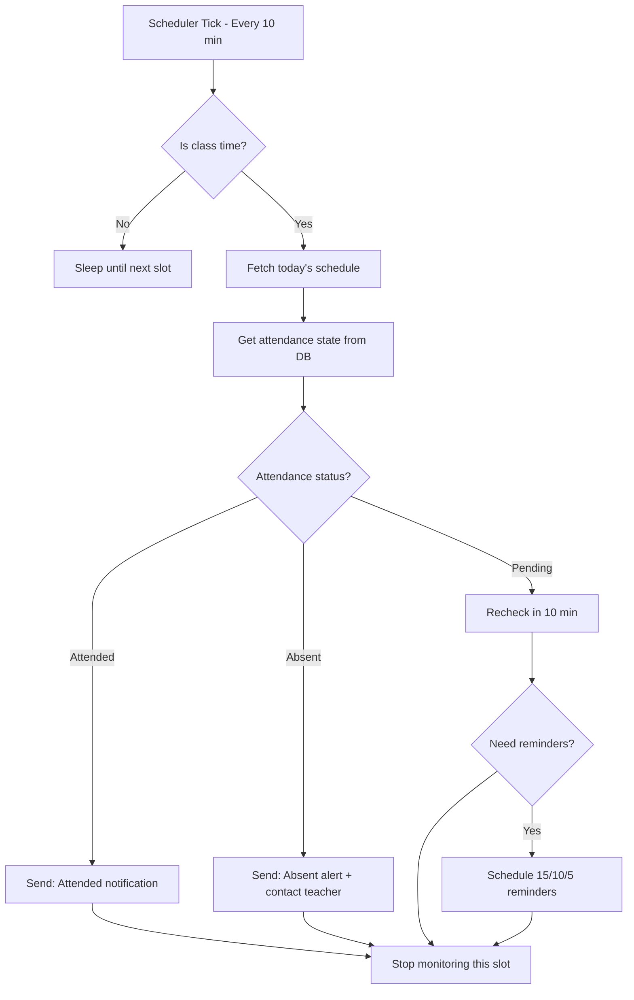
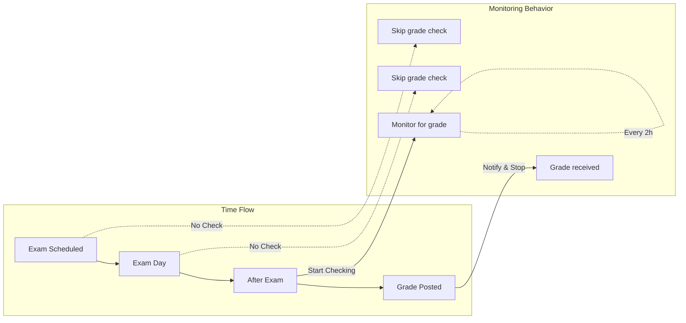
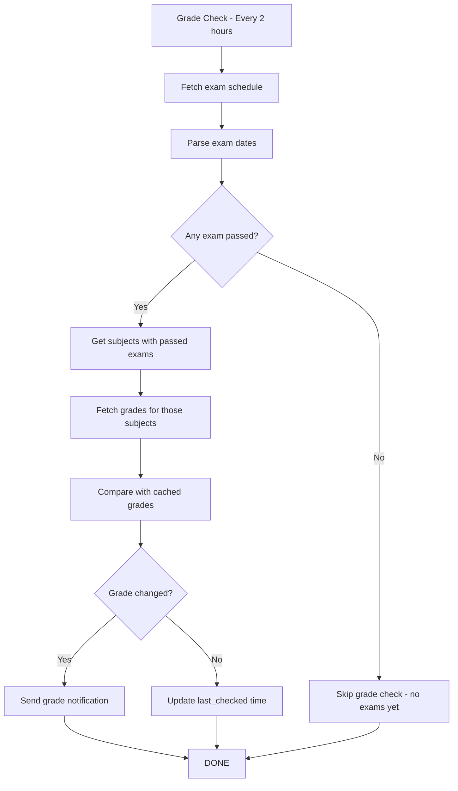
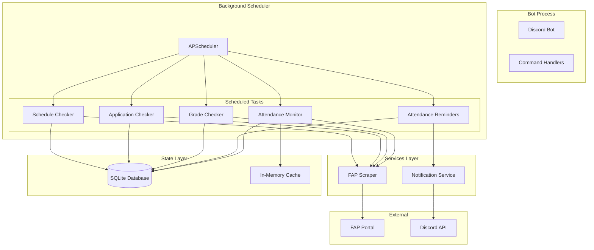

# Scheduling and Notifications Architecture
## FAP Discord Bot - Background Task System

**Version:** 1.3
**Date:** 2026-03-12
**Author:** Admin + Winston (Architect Agent)
**Status:** Design Document

---

## Table of Contents

1. [Overview](#overview)
2. [Current Status](#current-status)
3. [Proposed Solution](#proposed-solution)
4. [Task Frequencies](#task-frequencies)
5. [Architecture](#architecture)
6. [Database Schema](#database-schema)
7. [Implementation Phases](#implementation-phases)
8. [Technical Considerations](#technical-considerations)

---

## Overview

### Problem Statement
The bot currently only responds to manual commands. Users need proactive notifications for:
- Attendance status changes during class
- Upcoming class ending reminders (15/10/5 min)
- Grade updates
- Application status changes
- Schedule changes

### Design Goals
- **Timely**: Notifications within 5-10 minutes of FAP updates
- **Efficient**: Minimize resource usage (Playwright + Chrome is expensive)
- **Reliable**: Handle FAP downtime and session expiration gracefully
- **Non-intrusive**: Avoid duplicate notifications

---

## Current Status

### What Exists
- ✅ Scraper with FeID authentication (Playwright-based)
- ✅ Auto-refresh session mechanism
- ✅ Parsers: Schedule, Attendance, Grade, Exam
- ✅ Commands: `/schedule`, `/attendance`, `/grade`, `/exam`, `/status`
- ✅ `asyncio.Lock` for concurrent Chrome access prevention

### What's Missing
- ❌ Background scheduler (APScheduler integration)
- ❌ Automatic scraping tasks
- ❌ State tracking for notifications
- ❌ Reminder system for class endings

---

## Proposed Solution

### 1. Attendance Monitoring

**Logic Flow:**



**Key Features:**
- Only monitor during active class slots
- Stop monitoring once attendance is confirmed
- Send escalating warnings before class ends
- Per-slot state tracking to avoid duplicates

### 2. Attendance Reminders (15/10/5 minutes before end)

**Dynamic Scheduling:**

```
For a slot 7:00-9:15 (135 minutes):

├─ 7:00  → Start monitoring
├─ 7:10  → Check #1: Attendance status?
├─ 7:20  → Check #2: Attendance status?
├─ 7:30  → Check #3: Attendance status?
├─ ...
├─ 9:00  → ⚠️ REMINDER: 15 minutes left! Check attendance!
├─ 9:05  → ⚠️ REMINDER: 10 minutes left!
├─ 9:10  → 🚨 REMINDER: 5 minutes - Last chance!
├─ 9:15  → Slot ends - Stop monitoring
```

**Implementation:**
```python
# Dynamic job scheduling based on slot end time
def schedule_reminders(slot_end_time, subject_code):
    now = datetime.now()

    # 15 minutes before
    schedule_reminder(slot_end_time - timedelta(minutes=15), subject_code, "15")
    # 10 minutes before
    schedule_reminder(slot_end_time - timedelta(minutes=10), subject_code, "10")
    # 5 minutes before
    schedule_reminder(slot_end_time - timedelta(minutes=5), subject_code, "5")
```

---

## Task Frequencies

| Task | Frequency | When Active | Notes |
|------|-----------|-------------|-------|
| **Attendance Monitor** | 10 minutes | During class hours only | Stop when attended confirmed |
| **Attendance Reminders** | Dynamic | 15/10/5 min before slot end | Per-slot dynamic scheduling |
| **Grades Check** | 2 hours | Only for subjects with passed exams | Check exam schedule to determine |
| **Applications Check** | 30 minutes | If pending exists | Daily if no pending apps |
| **Schedule Check** | Weekly | Sunday night | For upcoming week |
| **Exam Schedule Check** | Weekly | Sunday night | Used to trigger grade monitoring |

### Pending Checks Command

A comprehensive slash command `/pending-checks` has been added to view all pending items:

**Features:**
1. **Waiting for Grades** - Subjects with passed exams but no grade yet
2. **Pending Applications** - Applications waiting for approval
3. **Unmarked Attendance** - Today's classes with attendance not yet recorded
4. **Upcoming Exams** - Exams in next 7 days
5. Color-coded urgency indicators for each category

**Usage:**
```
/pending-checks            # Show all pending items
/pending-checks grades     # Show only waiting grades
/pending-checks exams      # Show only upcoming exams
/pending-checks attendance # Show only unmarked attendance today
```

**Main Dashboard Output:**
```
⏳ Pending Checks Dashboard
Items being monitored for updates

📊 Waiting for Grades (2)
🟡 CS105 - 5 days
🟢 MA201 - 2 days

📋 Pending Applications (1)
⏳ Hoãn nghĩa vụ quân sự
   📝 Dạ em xin giấy hoãn nghĩa vụ...
   📅 27/08/2025

📋 Attendance Not Marked (1)
⏳ CS105 - Introduction to Programming
   📅 12/03/2026 | Slot 3

📅 Upcoming Exams (2)
📌 CS205 - 20/02/2026
📝 MA301 - 25/02/2026

Auto-Monitoring:
• Grades: Every 2h (after exam)
• Applications: Every 30min (if pending)
• Attendance: Every 10min (during class)
```

**Individual Sub-command Examples:**

```
/pending-checks grades
⏳ Waiting for Grades (2 subjects)

📊 CS105 - Introduction to Programming
   📅 Exam: 15/02/2026 at 07h00-09h00
   ⏱️ 🟡 5 days ago (Few days)

📊 MA201 - Linear Algebra
   📅 Exam: 20/02/2026 at 09h30-11h45
   ⏱️ 🟢 2 days ago (Recently)
```

```
/pending-checks attendance
⏳ Unmarked Attendance (1 classes)

📚 CS105 - Object-Oriented Programming
   📅 12/03/2026 | Slot 3
   🕐 12:30 - 14:45
   ⚠️ 🟠 Less than 30 min
```

**Urgency Color Codes:**

| Category | 🟢 Green | 🟡 Yellow | 🟠 Orange | 🔴 Red |
|----------|---------|----------|-----------|--------|
| **Grades** | ≤3 days ago | 4-7 days | 8-14 days | >14 days |
| **Attendance** | Ongoing | >30 min left | ≤30 min left | Class ended |
| **Exams** | >3 days | 1-3 days | Tomorrow | Today |

### Grade Monitoring Logic

**Key Optimization:** Only check grades for subjects where exams have already passed.



**Before vs After:**

| Aspect | Before (Naive) | After (Smart) |
|--------|---------------|---------------|
| Check frequency | Every 2 hours, all subjects | Only subjects with passed exams |
| Resource usage | ~10-15 requests/check | ~1-3 requests/check |
| FAP load | High (all subjects) | Low (filtered subjects) |
| Relevance | Most checks wasted | Only meaningful checks |



**Algorithm:**
```python
async def check_grades():
    # 1. Get exam schedule
    exams = await fetch_exam_schedule()
    now = datetime.now()

    # 2. Find subjects with passed exams (no grade yet)
    subjects_waiting = []
    for exam in exams:
        if exam.date < now.date():
            # Exam passed - check if grade exists
            cached = get_cached_grade(exam.subject_code)
            if not cached or cached.total == 0:  # No grade yet
                subjects_waiting.append(exam.subject_code)

    # 3. Only fetch grades for subjects in waiting list
    if subjects_waiting:
        grades = await fetch_grades(subjects=subjects_waiting)
        for grade in grades:
            if is_new_or_changed(grade):
                await notify_grade_update(grade)
            cache_grade(grade)
```

### Slot Time Reference

| Slot | Time | Duration |
|------|------|----------|
| 1 | 7:00 - 9:15 | 135 min |
| 2 | 9:30 - 11:45 | 135 min |
| 3 | 12:30 - 14:45 | 135 min |
| 4 | 15:00 - 17:15 | 135 min |
| 5 | 17:30 - 19:45 | 135 min |
| 6 | 19:45 - 22:00 | 135 min |
| 7 | 22:00 - 00:00 | 120 min |
| 8 | 00:00 - 7:00 | 420 min |

---

## Architecture

### System Overview



### Component: Attendance Monitor

```python
class AttendanceMonitor:
    """
    Monitors attendance status during active class slots

    Schedule:
    - Runs every 10 minutes
    - Only active during class hours (slots 1-6)
    - Stops monitoring once attendance is confirmed
    """

    SLOT_TIMES = {
        1: ("07:00", "09:15"),
        2: ("09:30", "11:45"),
        3: ("12:30", "14:45"),
        4: ("15:00", "17:15"),
        5: ("17:30", "19:45"),
        6: ("19:45", "22:00"),
    }

    async def run(self):
        """Main monitoring loop"""
        current_slot = self.get_current_slot()

        if not current_slot:
            return  # Not in class time

        # Get today's schedule
        schedule = await self.fetch_schedule()

        for item in schedule:
            if item.slot == current_slot:
                await self.monitor_subject(item)

    async def monitor_subject(self, schedule_item):
        """Monitor a specific subject for attendance"""
        state = self.get_state(schedule_item)

        if state.status == 'attended':
            await self.notify_attended(schedule_item)
            await self.stop_monitoring(schedule_item)
            return

        if state.status == 'absent':
            await self.notify_absent(schedule_item)
            await self.stop_monitoring(schedule_item)
            return

        # Still pending - check attendance
        attendance = await self.fetch_attendance(schedule_item)

        if attendance != state.status:
            await self.handle_status_change(schedule_item, attendance)
```

### Component: Reminder Scheduler

```python
class ReminderScheduler:
    """
    Schedules dynamic reminders for class endings

    Triggers:
    - 15 minutes before slot ends
    - 10 minutes before slot ends
    - 5 minutes before slot ends
    """

    async def schedule_slot_reminders(self, schedule_item):
        """Schedule reminders for a specific slot"""
        slot_end = self.parse_slot_end_time(
            schedule_item.date,
            schedule_item.slot
        )

        # Calculate reminder times
        reminders = [
            (slot_end - timedelta(minutes=15), "15"),
            (slot_end - timedelta(minutes=10), "10"),
            (slot_end - timedelta(minutes=5), "5"),
        ]

        for reminder_time, minutes in reminders:
            if reminder_time > datetime.now():
                self.scheduler.add_job(
                    self.send_reminder,
                    'date',
                    run_date=reminder_time,
                    args=[schedule_item, minutes]
                )
```

### Component: Grade Checker (Smart)

```python
class GradeChecker:
    """
    Monitors grades ONLY for subjects with passed exams

    Key Optimization:
    - Uses exam schedule to determine when to check grades
    - Only fetches grades for subjects where exam is done
    - Skips subjects without exams or with existing grades

    Schedule:
    - Runs every 2 hours
    - Filters subjects by exam completion
    - Stops checking once grade is received
    """

    async def run(self):
        """Main grade check loop"""
        # 1. Get exam schedule
        exams = await self.fetch_exam_schedule()
        now = datetime.now()

        # 2. Find subjects with passed exams but no grade
        subjects_to_check = []
        for exam in exams:
            if self.is_exam_passed(exam, now):
                # Check if we already have the grade
                cached = self.db.get_grade(exam.subject_code)
                if not cached or not self.has_grade(cached):
                    subjects_to_check.append(exam.subject_code)

        # 3. Only fetch if there's something to check
        if not subjects_to_check:
            logger.info("No subjects waiting for grades - skipping check")
            return

        logger.info(f"Checking grades for {len(subjects_to_check)} subjects")

        # 4. Fetch and compare
        for subject_code in subjects_to_check:
            await self.check_subject_grade(subject_code)

    def is_exam_passed(self, exam, now):
        """Check if exam date has passed"""
        exam_datetime = datetime.combine(exam.date, self.parse_exam_time(exam.time))
        return exam_datetime < now

    def has_grade(self, cached_grade):
        """Check if cached grade has actual grade value"""
        return cached_grade and cached_grade.total > 0

    async def check_subject_grade(self, subject_code):
        """Check grade for a specific subject"""
        new_grade = await self.fetch_subject_grade(subject_code)
        cached = self.db.get_grade(subject_code)

        if not cached:
            # New grade discovered
            await self.notify_new_grade(new_grade)
            self.db.cache_grade(new_grade)
        elif new_grade.total != cached.total:
            # Grade changed (rare, but possible)
            await self.notify_grade_changed(cached, new_grade)
            self.db.cache_grade(new_grade)
        else:
            # No change - just update check time
            self.db.update_checked_time(subject_code)
```

### Component: Exam Schedule Checker (Triggers Grade Monitoring)

```python
class ExamScheduleChecker:
    """
    Checks for exam schedule changes

    Important: This triggers grade monitoring for passed exams

    Schedule:
    - Runs weekly (Sunday night)
    - Detects new/changed exams
    - Notifies of upcoming exams
    """

    async def run(self):
        """Weekly exam schedule check"""
        exams = await self.fetch_exam_schedule()
        cached = self.db.get_cached_exams()

        # 1. Detect changes
        new_exams = self.find_new_exams(exams, cached)
        changed_exams = self.find_changed_exams(exams, cached)

        # 2. Notify of changes
        for exam in new_exams:
            await self.notify_new_exam(exam)

        for exam in changed_exams:
            await self.notify_exam_changed(exam)

        # 3. Update cache
        self.db.cache_exams(exams)

        # 4. Check for newly passed exams (to trigger grade monitoring)
        await self.check_newly_passed_exams(exams)

    async def check_newly_passed_exams(self, exams):
        """Find exams that just passed - these need grade monitoring"""
        now = datetime.now()
        recently_passed = []

        for exam in exams:
            exam_datetime = datetime.combine(exam.date, self.parse_exam_time(exam.time))
            # If exam passed in last 24 hours
            if (now - exam_datetime).total_seconds() < 86400 and now > exam_datetime:
                recently_passed.append(exam.subject_code)

        if recently_passed:
            logger.info(f"Exams just passed: {recently_passed}")
            # Trigger immediate grade check
            await self.trigger_grade_check(recently_passed)
```
```

---

## Database Schema

### Attendance Monitor State

```sql
-- Track attendance monitoring state per slot
CREATE TABLE attendance_monitor_state (
    user_id TEXT NOT NULL,
    date DATE NOT NULL,
    slot INTEGER NOT NULL,
    subject_code TEXT NOT NULL,
    subject_name TEXT,

    -- State tracking
    status TEXT DEFAULT 'pending',  -- 'pending', 'attended', 'absent'
    monitor_active BOOLEAN DEFAULT 1,

    -- Notification flags
    notified_15min BOOLEAN DEFAULT 0,
    notified_10min BOOLEAN DEFAULT 0,
    notified_5min BOOLEAN DEFAULT 0,
    notified_completed BOOLEAN DEFAULT 0,

    -- Metadata
    last_checked TIMESTAMP,
    first_checked TIMESTAMP,
    updated_at TIMESTAMP DEFAULT CURRENT_TIMESTAMP,

    PRIMARY KEY (user_id, date, slot, subject_code)
);

-- Index for active monitoring queries
CREATE INDEX idx_attendance_active
ON attendance_monitor_state(user_id, date, monitor_active)
WHERE monitor_active = 1;
```

### Notification History

```sql
-- Track sent notifications to avoid duplicates
CREATE TABLE notification_history (
    id INTEGER PRIMARY KEY AUTOINCREMENT,
    user_id TEXT NOT NULL,
    notification_type TEXT NOT NULL,  -- 'attendance', 'grade', 'reminder', etc.
    reference_id TEXT NOT NULL,        -- subject_code, exam_id, etc.
    reference_date DATE,               -- For contextual reference

    -- Notification content
    title TEXT,
    message TEXT,

    -- Status
    sent_at TIMESTAMP DEFAULT CURRENT_TIMESTAMP,
    status TEXT DEFAULT 'sent',       -- 'sent', 'failed'
    error_message TEXT,

    -- Deduplication
    hash TEXT UNIQUE,                  -- Content hash for dedup

    FOREIGN KEY (user_id) REFERENCES users(user_id)
);

CREATE INDEX idx_notification_lookup
ON notification_history(user_id, notification_type, reference_id, sent_at DESC);
```

### Grade Tracking

```sql
-- Track known grades to detect changes
CREATE TABLE grade_cache (
    user_id TEXT NOT NULL,
    term TEXT NOT NULL,
    subject_code TEXT NOT NULL,

    -- Grade data
    mid_term REAL,
    final REAL,
    total REAL,
    grade_4scale TEXT,
    status TEXT,
    credits INTEGER,

    -- Tracking
    first_seen TIMESTAMP,
    last_updated TIMESTAMP DEFAULT CURRENT_TIMESTAMP,
    last_checked TIMESTAMP DEFAULT CURRENT_TIMESTAMP,
    change_count INTEGER DEFAULT 0,

    PRIMARY KEY (user_id, term, subject_code)
);

-- Index for recent grade checks
CREATE INDEX idx_grade_recent
ON grade_cache(user_id, last_checked DESC);
```

### Application Tracking

```sql
-- Track application status
CREATE TABLE application_cache (
    user_id TEXT NOT NULL,
    app_id TEXT NOT NULL,

    -- Application data
    app_type TEXT,
    purpose TEXT,
    status TEXT,                    -- 'Pending', 'Approved', 'Rejected'
    created_date DATE,
    process_note TEXT,

    -- Tracking
    first_seen TIMESTAMP,
    last_updated TIMESTAMP DEFAULT CURRENT_TIMESTAMP,
    last_checked TIMESTAMP DEFAULT CURRENT_TIMESTAMP,
    status_change_count INTEGER DEFAULT 0,

    PRIMARY KEY (user_id, app_id)
);

-- Index for pending applications
CREATE INDEX idx_app_pending
ON application_cache(user_id, status)
WHERE status = 'Pending';
```

---

## Implementation Phases

### Phase 1: Foundation (Week 1)
**Goal:** Basic scheduler infrastructure

- [ ] Integrate APScheduler with bot
- [ ] Create database schema for state tracking
- [ ] Implement `NotificationService` class
- [ ] Create `StateManager` for tracking states

**Deliverables:**
- Scheduler starts with bot
- Database tables created
- Basic notification sending works

---

### Phase 2: Attendance Monitoring (Week 1-2)
**Goal:** Core attendance monitoring

- [ ] Implement `AttendanceMonitor` task
- [ ] Add current slot detection logic
- [ ] Implement state checking/updating
- [ ] Create attendance change notifications
- [ ] Add stop-monitoring logic when attended

**Deliverables:**
- Attendance checked every 10 min during class
- Notifications sent when status changes
- Monitoring stops when attended

---

### Phase 3: Attendance Reminders (Week 2)
**Goal:** Escalating reminders

- [ ] Implement `ReminderScheduler`
- [ ] Add dynamic job scheduling
- [ ] Create reminder notifications (15/10/5)
- [ ] Add reminder state tracking
- [ ] Prevent duplicate reminders

**Deliverables:**
- Reminders sent at 15/10/5 min before slot end
- Only sent if attendance not confirmed
- Mark as sent in database

---

### Phase 4: Grade Monitoring (Week 2-3)
**Goal:** Smart grade update detection based on exam schedule

- [ ] Implement `GradeChecker` task with exam-based filtering
- [ ] Add exam schedule integration
- [ ] Implement "waiting for grade" detection logic
- [ ] Add grade comparison for subjects with passed exams only
- [ ] Create grade change notifications
- [ ] Implement GPA calculation on change

**Deliverables:**
- Grades checked ONLY for subjects with passed exams
- Notifications for new grades
- Notifications for grade changes
- Efficient resource usage (no unnecessary checks)

---

### Phase 5: Application Monitoring (Week 3)
**Goal:** Application status tracking

- [ ] Implement `ApplicationChecker` task
- [ ] Add status change detection
- [ ] Create status change notifications
- [ ] Implement dynamic frequency (30min if pending)

**Deliverables:**
- Applications checked regularly
- Status changes notified
- Faster checks for pending apps

---

### Phase 6: Schedule & Exam (Week 3-4)
**Goal:** Weekly checks for less frequent data + Exam-based grade triggering

- [ ] Implement `ScheduleChecker` (weekly)
- [ ] Implement `ExamScheduleChecker` (weekly)
- [ ] Add change detection for exams
- [ ] Create "newly passed exam" detection to trigger grade monitoring
- [ ] Create change notifications

**Deliverables:**
- Weekly schedule checks
- Weekly exam schedule checks
- Automatic grade monitoring trigger when exam passes
- Change notifications

---

## Technical Considerations

### 1. Resource Optimization

**Problem:** Playwright + Chrome is resource-intensive

**Solutions:**
```python
# Solution 1: Only launch browser when needed
async def smart_fetch(url):
    # Check cache first
    cached = cache.get(url)
    if cached and not is_stale(cached):
        return cached

    # Only launch browser if cache miss
    return await fetch_with_playwright(url)

# Solution 2: Batch multiple checks in one browser session
async def batch_check(urls):
    async with async_playwright() as p:
        browser = await p.chromium.launch()
        for url in urls:
            # Reuse browser for multiple requests
            await check_page(browser, url)
```

### 2. Rate Limiting

**Problem:** FAP may block frequent requests

**Solutions:**
```python
# Request queue with delay
class RequestQueue:
    def __init__(self, min_delay=2.0):
        self.queue = asyncio.Queue()
        self.min_delay = min_delay
        self.last_request = None

    async def fetch(self, url):
        # Ensure minimum delay between requests
        if self.last_request:
            elapsed = time.time() - self.last_request
            if elapsed < self.min_delay:
                await asyncio.sleep(self.min_delay - elapsed)

        result = await self._do_fetch(url)
        self.last_request = time.time()
        return result
```

### 3. Session Management

**Already Implemented:**
- ✅ `FAPAuth` with auto-refresh
- ✅ `asyncio.Lock` to prevent concurrent Chrome access
- ✅ Cookie persistence in `fap_cookies.json`

**Additional Consideration:**
```python
# Add request retry with exponential backoff
async def fetch_with_retry(fetch_func, max_retries=3):
    for attempt in range(max_retries):
        try:
            return await fetch_func()
        except SessionExpired:
            if attempt < max_retries - 1:
                await refresh_session()
                await asyncio.sleep(2 ** attempt)  # Exponential backoff
            else:
                raise
```

### 4. Notification Deduplication

**Problem:** Avoid sending the same notification multiple times

**Solution:**
```python
def should_send_notification(user_id, notif_type, reference_id, content):
    # Create content hash
    content_hash = hashlib.md5(content.encode()).hexdigest()

    # Check if already sent
    existing = db.execute("""
        SELECT id FROM notification_history
        WHERE user_id = ? AND notification_type = ?
        AND reference_id = ? AND hash = ?
        AND sent_at > datetime('now', '-1 hour')
    """, (user_id, notif_type, reference_id, content_hash)).fetchone()

    return existing is None
```

### 5. Error Handling

**Strategy:** Fail gracefully, show cached data if available

```python
async def safe_monitor(task_func, task_name):
    try:
        await task_func()
    except FAPDownException:
        logger.warning(f"FAP is down - {task_name} skipped")
        # No action, will retry on next schedule
    except ParseError:
        logger.error(f"Parse error in {task_name}")
        notify_admin(f"Parse error in {task_name}")
    except Exception as e:
        logger.error(f"Unexpected error in {task_name}: {e}")
        notify_admin(f"Error in {task_name}: {e}")
```

---

## Configuration

### Environment Variables

```bash
# Scheduler Configuration
SCHEDULER_ENABLED=true
ATTENDANCE_CHECK_INTERVAL=600  # 10 minutes in seconds
GRADE_CHECK_INTERVAL=7200      # 2 hours in seconds
APPLICATION_CHECK_INTERVAL=1800  # 30 minutes in seconds

# Notification Settings
NOTIFICATION_CHANNEL_ID=your_channel_id
REMINDER_ENABLED=true
REMINDER_TIMES=15,10,5  # Minutes before slot end

# FAP Settings
FAP_BASE_URL=https://fap.fpt.edu.vn
FAP_REQUEST_DELAY=2.0  # Seconds between requests

# Session Settings
SESSION_REFRESH_ENABLED=true
SESSION_COOKIE_TTL=604800  # 7 days in seconds
```

### APScheduler Configuration

```python
from apscheduler.schedulers.asyncio import AsyncIOScheduler
from apscheduler.jobstores.sqlalchemy import SQLAlchemyJobStore

scheduler = AsyncIOScheduler(
    jobstores={
        'default': SQLAlchemyJobStore(url='sqlite:///jobs.sqlite')
    },
    job_defaults={
        'coalesce': True,  # Combine missed jobs
        'max_instances': 1,  # Prevent overlapping
        'misfire_grace_time': 300  # 5 minutes grace
    }
)
```

---

## Monitoring & Logging

### Key Metrics to Track

| Metric | Description | Alert Threshold |
|--------|-------------|-----------------|
| Scheduler Uptime | % of time scheduler is running | < 99% |
| Task Success Rate | % of tasks completing successfully | < 95% |
| Avg Task Duration | Average time per task | > 30 seconds |
| FAP Errors | Number of FAP-related errors | > 10/hour |
| Notifications Sent | Number of notifications per hour | - |
| Duplicate Prevention | % of notifications prevented from duplicates | - |

### Logging Strategy

```python
# Structured logging for monitoring
logger.info(
    "attendance_check_completed",
    extra={
        "user_id": user_id,
        "subject": subject_code,
        "slot": slot,
        "status": status,
        "changed": status_changed,
        "duration_ms": duration
    }
)
```

---

## Appendix

### A. Task Priorities

| Priority | Task | Rationale |
|----------|------|-----------|
| P0 | Attendance Monitoring | Direct academic impact |
| P0 | Attendance Reminders | Prevents missed attendance |
| P1 | Grade Monitoring | Important but less urgent |
| P2 | Application Monitoring | Less frequent need |
| P3 | Schedule/Exam Checks | Least frequent changes |

### B. Testing Strategy

1. **Unit Tests:**
   - Slot detection logic
   - State management
   - Notification deduplication

2. **Integration Tests:**
   - Scheduler task execution
   - Database operations
   - FAP scraper integration

3. **Manual Tests:**
   - Full attendance monitoring flow
   - Reminder scheduling
   - Notification delivery

### C. Rollout Plan

1. **Week 1:** Deploy to development environment
2. **Week 2:** Test with single user (Admin)
3. **Week 3:** Gradual rollout to additional users
4. **Week 4:** Monitor and optimize

---

**Document Status:** ✅ Ready for Implementation
**Next Steps:** Create technical specification → Begin Phase 1 implementation

---

## Change History

| Version | Date | Author | Changes |
|---------|------|--------|---------|
| 1.0 | 2026-03-12 | Admin + Winston | Initial design document |
| 1.1 | 2026-03-12 | Admin + Winston | Added smart grade monitoring - only check grades when exam has passed |
| 1.2 | 2026-03-12 | Admin + Winston | Added `/pending-checks` command for viewing pending items |
| 1.3 | 2026-03-12 | Admin + Winston | Expanded `/pending-checks` - added applications, attendance, urgency indicators |
